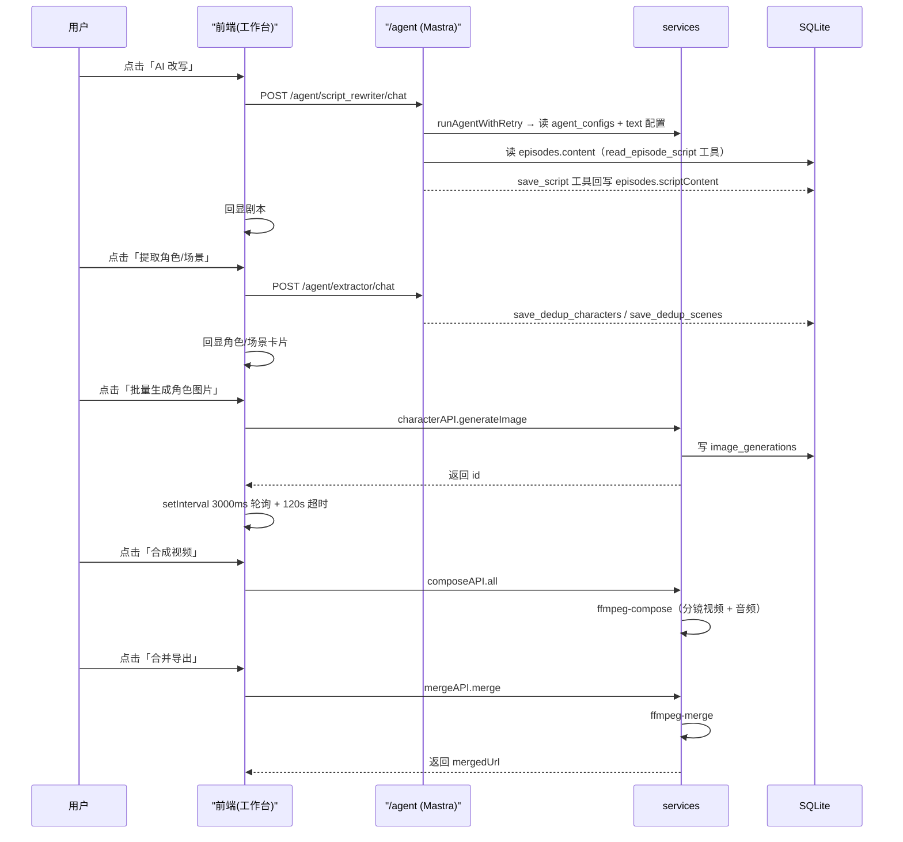

# Drama Studio（短剧工坊）按钮级功能分析文档

> 本文档为 voide-darme 项目的**功能级**代码分析文档，参照 gcc-printfilm-main 项目的文档风格，逐页面、逐按钮、逐函数梳理前后端实现。
> 配套文档：《api-contract.md》（接口契约）、《README.md》（启动说明）。
> 生成方式：从代码反推，逐文件精读 + 逐函数搜索，保证与源码一致。

---

## 目录

1. [项目概览](#1-项目概览)
2. [全局外壳（Layouts）](#2-全局外壳layouts)
3. [数据模型（DB Schema）](#3-数据模型db-schema)
4. [前端页面逐按钮功能](#4-前端页面逐按钮功能)
5. [前端组件](#5-前端组件)
6. [前端 Composable](#6-前端-composable)
7. [后端路由](#7-后端路由)
8. [后端服务层](#8-后端服务层)
9. [Agent 体系](#9-agent-体系)
10. [Skill 体系](#10-skill-体系)
11. [GPU 监控与本地模型](#11-gpu-监控与本地模型)
12. [AI 配置系统](#12-ai-配置系统)
13. [生成链路时序图](#13-生成链路时序图)
14. [部署](#14-部署)
15. [迁移核对清单](#15-迁移核对清单)

**附录**
- [附录 A：5 个 Agent 默认 Prompt 原文](#附录-a5-个-agent-默认-prompt-原文可迁移照抄)
- [附录 B：Agent 配置默认值速查](#附录-bagent-配置默认值速查)
- [附录 C：已知缺陷清单](#附录-c已知缺陷清单)

---

## 1. 项目概览

### 1.1 技术栈

| 层 | 技术 | 版本 / 说明 |
|----|------|------------|
| 前端框架 | Nuxt 3 + Vue 3 | Nuxt `^3.17.5`，Vue `^3.5.13`，TypeScript `^5.8.3` |
| 前端路由 | vue-router | `^4.5.1` |
| UI 反馈 | vue-sonner | toast 通知 |
| 图标 | lucide-vue-next | `^0.468.0` |
| 后端框架 | **Hono** | `^4.12.9` + `@hono/node-server`（非 Express） |
| 数据库 ORM | **Drizzle** | `drizzle-orm ^0.45.0` + `better-sqlite3 ^12.8.0` |
| Agent 框架 | **Mastra** | `@mastra/core ^1.17.x` |
| AI SDK | @ai-sdk/openai + @ai-sdk/google | `^2.x` |
| 媒体处理 | fluent-ffmpeg + sharp | 视频合成 / 图片切割 |
| 校验/日志/配置 | zod + pino + yaml | |

### 1.2 端口与目录

| 项 | 值 |
|----|-----|
| 后端端口 | `5789`（`configs/config.yaml` 可改） |
| 前端端口 | `3013`（`npx nuxt dev --port 3013`） |
| API 前缀 | `/api/v1` |
| 数据库文件 | `data/drama.db`（SQLite） |
| 静态资源目录 | `data/static`（`/static/*` 暴露） |
| 配置优先级 | 环境变量 `CONFIG_PATH` > `configs/config.yaml` > 代码默认值 |

### 1.3 目录结构

```
voide-darme/
├── backend/
│   └── src/
│       ├── index.ts              # 入口：Hono app + 中间件 + 路由挂载 + 启动任务
│       ├── config.ts             # 配置加载（env > yaml > 默认）
│       ├── db/
│       │   ├── schema.ts         # 19 张表 Drizzle schema
│       │   └── index.ts          # db 实例
│       ├── routes/               # 22 个路由文件
│       ├── services/             # 9 个服务 + adapters/（15 文件：12 厂商适配器 + registry/types/url）
│       ├── agents/               # Mastra Agent（index.ts + skills.ts + protocol.ts + tools/）
│       ├── evaluation/           # 评测闭环（types/scorer/evaluator/optimizer/cli）
│       ├── shared/               # prompt-utils.ts（统一视觉 Prompt 工具）
│       ├── middleware/           # logger.ts（requestLogger + errorHandler；cors 在 index.ts 内联）
│       └── utils/                # storage / task-logger / transform / video-probe / merge-queue / response
├── frontend/
│   └── app/
│       ├── app.vue               # 根组件（NuxtLayout + NuxtPage + Toaster）
│       ├── assets/               # studio.css 全局样式
│       ├── pages/                # 11 个页面（index/settings/library/drama/*）
│       ├── components/           # 5 个共享组件
│       ├── composables/          # useApi.ts / useAgent.ts
│       └── layouts/              # default.vue / studio.vue
├── configs/config.yaml           # 后端配置（从 config.example.yaml 复制）
└── data/                         # SQLite 数据库 + 静态资源
```

### 1.4 核心业务链路（一句话）

用户创建**短剧（drama）** → 添加**集（episode）**并锁定图像/视频/音频三配置 → 在工作台依次执行：**剧本改写 → 角色/场景提取 → 音色分配 → 分镜拆解 → 图片/视频生产 → 合成/合并导出**。

> **本章要点**：全项目三大技术锚点是「后端 Hono（非 Express）」「Agent 用 Mastra（非自研）」「ORM 用 Drizzle + better-sqlite3」；核心链路从 drama→episode（创建即锁三配置）单向推进，后续各阶段均在此链条上增量产出。

---

## 2. 全局外壳（Layouts）

### 2.1 `layouts/default.vue` — 常规布局

| 元素 | 触发动作 | 事件 / 服务调用 |
|------|---------|----------------|
| 顶部导航栏 | 渲染全局 header | 无逻辑，纯 UI 容器 |
| `<slot />` | 页面内容注入 | 承载 index/settings/library/drama 详情等页 |

### 2.2 `layouts/studio.vue` — 工作台布局

| 元素 | 触发动作 | 事件 / 服务调用 |
|------|---------|----------------|
| 全屏容器 | 渲染工作台 | 承载 `episode/[episodeNumber].vue` |
| 无顶部导航 | 沉浸式编辑 | 区别于 default 布局 |

> 页面通过 `definePageMeta({ layout: 'studio' })` 或路由约定切换到 studio 布局。

### 2.3 `app.vue` — 根组件 + `assets/studio.css`

| 元素 | 说明 |
|------|------|
| `<NuxtLayout><NuxtPage /></NuxtLayout>` | 标准 Nuxt 根组件骨架 |
| `<Toaster position="top-right" :duration="3000" />` | vue-sonner 全局 toast，右上角、3s 自动消失 |
| `<style>@import './assets/studio.css'</style>` | 引入全局样式（工作台暗色主题等基础样式） |

> **本章要点**：default 布局带顶部导航，studio 布局是无导航的沉浸式工作台（仅工作台页用），切换靠 `definePageMeta({ layout: 'studio' })`；全局 toast 在 `app.vue` 用 vue-sonner 统一注入（右上角 3s 自动消失）。

---

## 3. 数据模型（DB Schema）

`backend/src/db/schema.ts` 定义 **19 张表**，从 `PRAGMA table_info()` 逆向生成，列名精确匹配 SQLite。

> 类型说明：`INTEGER PK` = integer 自增主键；`INTEGER` = 可空整型；`BOOLEAN` = integer `mode:'boolean'`（SQLite 存 0/1）；`REAL` = 浮点；`TEXT` = 文本。`NN` = NOT NULL。默认值为 SQL 层默认。

### 3.1 核心业务（5 表）

**`dramas` — 短剧项目**

| 列 | 类型 | 约束/默认 | 说明 |
|----|------|----------|------|
| id | INTEGER PK | 自增 | |
| title | TEXT | NN | 项目名 |
| description | TEXT | | 项目描述 |
| genre | TEXT | | 题材 |
| style | TEXT | default `'realistic'` | 画风 |
| total_episodes | INTEGER | default `1` | 总集数 |
| total_duration | INTEGER | default `0` | 总时长(秒) |
| status | TEXT | NN default `'draft'` | 状态 |
| thumbnail | TEXT | | 封面图 URL |
| tags | TEXT | | JSON 字符串数组 |
| metadata | TEXT | | 扩展 JSON |
| created_at / updated_at | TEXT | NN | 应用层写入 |
| deleted_at | TEXT | | 软删除 |

**`episodes` — 集**

| 列 | 类型 | 约束/默认 | 说明 |
|----|------|----------|------|
| id | INTEGER PK | 自增 | |
| drama_id | INTEGER | NN | 所属项目 |
| episode_number | INTEGER | NN | 集号 |
| title | TEXT | NN | 集标题 |
| content | TEXT | | **原始剧本**（改写前） |
| script_content | TEXT | | **格式化剧本**（改写后，由 `save_script` 工具回写） |
| description | TEXT | | 集简介 |
| duration | INTEGER | default `0` | 时长(秒) |
| status | TEXT | default `'draft'` | |
| video_url | TEXT | | 成片 URL |
| thumbnail | TEXT | | 封面 |
| image_config_id | INTEGER | | **图片配置锁定** |
| video_config_id | INTEGER | | **视频配置锁定** |
| audio_config_id | INTEGER | | **音频配置锁定** |
| created_at / updated_at | TEXT | NN | |
| deleted_at | TEXT | | |

**`characters` — 角色**

| 列 | 类型 | 约束/默认 | 说明 |
|----|------|----------|------|
| id | INTEGER PK | 自增 | |
| drama_id | INTEGER | NN | 所属项目 |
| name | TEXT | NN | 角色名 |
| role | TEXT | | 角色定位 |
| description | TEXT | | 概述 |
| appearance | TEXT | | 外貌描述 |
| personality | TEXT | | 性格 |
| voice_style | TEXT | | 音色风格 |
| image_url | TEXT | | 立绘 |
| reference_images | TEXT | | 参考图 JSON |
| seed_value | TEXT | | 随机种子 |
| sort_order | INTEGER | | 排序 |
| local_path | TEXT | | 本地路径 |
| voice_sample_url | TEXT | | 试听样本 |
| voice_provider | TEXT | | 音色厂商 |
| voice_speed | REAL | default `1.0` | 语速 |
| voice_emotion | TEXT | default `'happy'` | 情感 |
| voice_pitch | REAL | default `0` | 音调 |
| clothing | TEXT | | 服装 |
| weapons | TEXT | | 武器 |
| custom_prompt | TEXT | | 自定义提示词 |
| voice_model | TEXT | default `'speech-2.8-hd'` | 音色模型 |
| created_at / updated_at | TEXT | NN | |
| deleted_at | TEXT | | |

**`scenes` — 场景**

| 列 | 类型 | 约束/默认 | 说明 |
|----|------|----------|------|
| id | INTEGER PK | 自增 | |
| drama_id | INTEGER | NN | 所属项目 |
| episode_id | INTEGER | | 首次出现的集 |
| location | TEXT | NN | 地点 |
| time | TEXT | NN | 时间段 |
| prompt | TEXT | NN | 图片生成 prompt |
| storyboard_count | INTEGER | default `1` | 分镜数 |
| image_url | TEXT | | 场景图 |
| status | TEXT | default `'pending'` | |
| local_path | TEXT | | |
| description | TEXT | | |
| atmosphere | TEXT | | 氛围 |
| lighting | TEXT | | 光线 |
| weather | TEXT | | 天气 |
| season | TEXT | | 季节 |
| style | TEXT | | 风格 |
| custom_prompt | TEXT | | |
| created_at / updated_at | TEXT | NN | |
| deleted_at | TEXT | | |

**`storyboards` — 分镜**

| 列 | 类型 | 约束/默认 | 说明 |
|----|------|----------|------|
| id | INTEGER PK | 自增 | |
| episode_id | INTEGER | NN | 所属集 |
| scene_id | INTEGER | | 关联场景 |
| storyboard_number | INTEGER | NN | 镜头序号 |
| title | TEXT | | 3-8 字标题 |
| location / time | TEXT | | 地点/时间段 |
| shot_type | TEXT | | 景别 |
| angle | TEXT | | 机位角度 |
| movement | TEXT | | 运镜 |
| action | TEXT | | 动作表演 |
| result | TEXT | | 结束画面状态 |
| atmosphere | TEXT | | 氛围 |
| image_prompt | TEXT | | 静态画面提示词 |
| video_prompt | TEXT | | 动态提示词 |
| bgm_prompt | TEXT | | 配乐风格 |
| sound_effect | TEXT | | 音效 |
| dialogue | TEXT | | 对白/旁白 |
| description | TEXT | | 镜头概述 |
| duration | INTEGER | default `0` | 时长(秒) |
| composed_image | TEXT | | 合成图 |
| first_frame_image / last_frame_image | TEXT | | 首帧/尾帧 |
| reference_images | TEXT | | 参考图 |
| video_url | TEXT | | 单镜头视频 |
| tts_audio_url | TEXT | | 配音音频 |
| subtitle_url | TEXT | | 字幕 |
| composed_video_url | TEXT | | 合成视频 |
| custom_image_prompt / custom_video_prompt | TEXT | | 自定义提示词 |
| status | TEXT | default `'pending'` | |
| created_at / updated_at | TEXT | NN | |
| deleted_at | TEXT | | |

### 3.2 关联表（3 表，多对多）

| 表 | 列 | 类型/约束 | 说明 |
|----|----|----------|------|
| `episode_characters` | id | INTEGER PK 自增 | 集↔角色 |
| | episode_id | INTEGER NN | |
| | character_id | INTEGER NN | |
| | created_at | TEXT NN | |
| `episode_scenes` | id | INTEGER PK 自增 | 集↔场景 |
| | episode_id / scene_id | INTEGER NN | |
| | created_at | TEXT NN | |
| `storyboard_characters` | storyboard_id | INTEGER NN | 分镜↔角色，**复合主键** `(storyboard_id, character_id)`，无自增 id、无 created_at |
| | character_id | INTEGER NN | |

### 3.3 AI 配置（4 表）

**`ai_service_configs` — 服务配置**（⚠️ 无 `deleted_at`）

| 列 | 类型 | 约束/默认 | 说明 |
|----|------|----------|------|
| id | INTEGER PK | 自增 | |
| service_type | TEXT | NN | `text`/`image`/`video`/`audio` |
| provider | TEXT | | 厂商 |
| name | TEXT | NN | 配置名 |
| base_url | TEXT | NN | |
| api_key | TEXT | NN | |
| model | TEXT | | **JSON 数组**（多模型 fallback） |
| endpoint | TEXT | | 接入点 ID |
| query_endpoint | TEXT | | 查询端点 |
| priority | INTEGER | default `0` | 同类型选择顺序 |
| is_default | BOOLEAN | default `false` | |
| is_active | BOOLEAN | default `true` | |
| settings | TEXT | | 扩展 JSON |
| created_at / updated_at | TEXT | NN | |

**`ai_service_providers` — 厂商目录**

| 列 | 类型 | 约束/默认 | 说明 |
|----|------|----------|------|
| id | INTEGER PK | 自增 | |
| name | TEXT | NN | 内部名 |
| display_name | TEXT | | 显示名 |
| service_type | TEXT | NN | |
| provider | TEXT | NN | |
| default_url | TEXT | | |
| preset_models | TEXT | | 预设模型 JSON |
| description | TEXT | | |
| endpoint_prefix | TEXT | | 端点前缀 |
| is_recommended | BOOLEAN | default `false` | |
| is_active | BOOLEAN | default `true` | |
| created_at / updated_at | TEXT | NN | |

**`ai_voices` — 音色库**

| 列 | 类型 | 约束/默认 | 说明 |
|----|------|----------|------|
| id | INTEGER PK | 自增 | |
| voice_id | TEXT | NN **unique** | MiniMax voice_id |
| voice_name | TEXT | NN | 中文名 |
| description | TEXT | | 描述数组 JSON |
| language | TEXT | | 语言标签 |
| provider | TEXT | NN | 固定 `minimax` |
| created_at | TEXT | NN | |

**`agent_configs` — Agent 配置**

| 列 | 类型 | 约束/默认 | 说明 |
|----|------|----------|------|
| id | INTEGER PK | 自增 | |
| agent_type | TEXT | NN | 5 种 Agent 类型 |
| name | TEXT | NN | |
| description | TEXT | | |
| model | TEXT | | 指定模型（前置候选） |
| system_prompt | TEXT | | 覆盖默认 prompt |
| temperature | REAL | | |
| max_tokens | INTEGER | | |
| max_iterations | INTEGER | | |
| skills | TEXT | | JSON `[{id, enabled, priority}]` |
| is_active | BOOLEAN | default `true` | |
| created_at / updated_at | TEXT | NN | |
| deleted_at | TEXT | | |

### 3.4 生成任务（3 表）

**`image_generations` — 图片生成**

| 列 | 类型 | 约束/默认 | 说明 |
|----|------|----------|------|
| id | INTEGER PK | 自增 | |
| storyboard_id / drama_id / scene_id / character_id | INTEGER | | 归属（可空，按类型填写） |
| image_type | TEXT | | 角色/场景/分镜 |
| frame_type | TEXT | | 首帧/尾帧/… |
| provider / model | TEXT | | |
| prompt / negative_prompt | TEXT | | |
| size / quality / style | TEXT | | |
| steps | INTEGER | | |
| cfg_scale | REAL | | |
| seed | INTEGER | | |
| image_url / local_path | TEXT | | |
| status | TEXT | default `'pending'` | pending/processing/success/failed |
| task_id | TEXT | | 厂商任务 ID |
| error_msg | TEXT | | |
| width / height | INTEGER | | |
| reference_images | TEXT | | 参考图 JSON |
| created_at / updated_at | TEXT | NN | |
| completed_at | TEXT | | |

**`video_generations` — 视频生成**

| 列 | 类型 | 约束/默认 | 说明 |
|----|------|----------|------|
| id | INTEGER PK | 自增 | |
| storyboard_id / drama_id | INTEGER | | |
| provider / model | TEXT | | |
| prompt | TEXT | | |
| image_gen_id | INTEGER | | 首帧图片来源 |
| reference_mode | TEXT | | 首帧/首尾帧/多参考 |
| image_url / first_frame_url / last_frame_url / reference_image_urls | TEXT | | |
| duration / fps | INTEGER | | |
| resolution / aspect_ratio / style | TEXT | | |
| motion_level | INTEGER | | |
| camera_motion | TEXT | | |
| seed | INTEGER | | |
| video_url / local_path | TEXT | | |
| status | TEXT | default `'pending'` | |
| task_id / error_msg | TEXT | | |
| width / height | INTEGER | | |
| created_at / updated_at | TEXT | NN | |
| completed_at | TEXT | | |
| deleted_at | TEXT | | |
| character_ids | TEXT | | 出镜角色 JSON |

**`video_merges` — 视频合并**

| 列 | 类型 | 约束/默认 | 说明 |
|----|------|----------|------|
| id | INTEGER PK | 自增 | |
| episode_id / drama_id | INTEGER | | |
| title | TEXT | | |
| provider / model | TEXT | NN | |
| status | TEXT | default `'pending'` | |
| scenes | TEXT | | JSON（合并片段清单） |
| merged_url | TEXT | | 成片 URL |
| duration | INTEGER | | |
| task_id / error_msg | TEXT | | |
| created_at | TEXT | NN | |
| completed_at | TEXT | | |
| deleted_at | TEXT | | |

### 3.5 资源库模板（4 表）

四张模板表结构高度一致：均含 `id / name / category(default '通用'|'剑') / description / image_url / reference_images / tags(JSON) / metadata(JSON) / source_drama_id / usage_count(default 0) / created_at(NN) / updated_at(NN) / deleted_at`，差异列如下：

| 表 | 特有列 | 说明 |
|----|--------|------|
| `character_templates` | `appearance(NN)`, `personality`, `clothing_style`, `expression`, `gender`, `age_group`, `voice_style`, `voice_provider`, `voice_config(JSON)` | 角色模板，`category` 默认 `'通用'` |
| `scene_templates` | `location`, `atmosphere`, `lighting`, `time_of_day`(清晨/白天/黄昏/夜晚/凌晨), `style`, `season`, `weather`, `prompt` | 场景模板 |
| `weapon_templates` | `type`(近战/远程/暗器/法宝), `appearance`, `material`, `attributes(JSON)`, `rank`(凡品/灵品/仙品/神品), `owner_character_name` | 兵器模板，`category` 默认 `'剑'` |
| `costume_templates` | `style`(古风/现代/仙侠/…), `body_part`(全身/上衣/…), `material`, `color_scheme`, `season`(春/夏/秋/冬), `appearance` | 服装模板 |

> **配置锁定机制**：`episodes` 表存 `image_config_id / video_config_id / audio_config_id` 三个外键，创建集时一次性锁定，后续所有生成链路都 `getConfigById(id)` 读取，保证同一集内风格一致。
>
> **软删除约定**：除 `ai_service_configs`、`ai_service_providers`、`ai_voices`、`storyboard_characters`、`image_generations` 外，其余表均含 `deleted_at` 软删除列。
>
> **无外键约束**：Drizzle schema 未声明 `foreignKey`，所有 `*_id` 均为逻辑外键，由应用层保证一致性。

> **易错点**：① episode 的 `image_config_id / video_config_id / audio_config_id` 在**创建集时一次性锁定**，后续生成全程 `getConfigById` 跟随，改配置需单独 `PUT /episodes/:id` 切换；② AI 配置 `model` 是 **JSON 数组**（多模型 fallback）而非单字符串；③ 全库**无外键约束**，一致性由应用层保证；④ 除 5 张表（ai_service_configs / ai_service_providers / ai_voices / storyboard_characters / image_generations）外，其余均软删除。

---

## 4. 前端页面逐按钮功能

前端共 **11 个页面**。

### 4.1 `pages/index.vue` — 首页（短剧项目列表）

| 元素 | 触发动作 | 事件 / 服务调用 |
|------|---------|----------------|
| 短剧项目卡片网格 | 点击卡片 | `navigateTo(\`/drama/${d.id}\`)` 进入详情 |
| 卡片右上「删除」按钮（hover 显示） | 点击 | `delDrama(d)` → `confirm()` → `dramaAPI.del(d.id)` → `load()` |
| 「新建项目」按钮 / 空状态卡 | 点击 | `showCreate = true` 打开弹窗 |
| 项目名称输入框 | 输入 | 绑定 `form.title`（`required` 必填） |
| 计划集数输入框 | 输入 | 绑定 `form.total_episodes`（number，min 1 / max 100，默认 1） |
| 视觉风格 BaseSelect | 选择 | 绑定 `form.style`，选项 `styles` 枚举 |
| 弹窗「创建项目」按钮 | 提交 | `create()` → `dramaAPI.create(form)` → **`navigateTo(\`/drama/${d.id}\`)`（跳转详情，非刷新列表）** |
| 弹窗「取消」按钮 | 点击 | `showCreate = false` |

**表单字段（仅 3 项，无 description）**：`{ title, total_episodes, style }`；`styles = ['realistic','anime','ghibli','cinematic','comic','watercolor']`。

**核心事件**：
```ts
const form = ref({ title: '', total_episodes: 1, style: '' })
async function load() { dramas.value = (await dramaAPI.list()).items || [] }
async function create() {
  if (!form.value.title?.trim()) return
  const d = await dramaAPI.create(form.value)   // 创建后跳转，不刷新列表
  showCreate.value = false
  navigateTo(`/drama/${d.id}`)
}
async function delDrama(d) {
  if (!confirm(`确定删除「${d.title}」？此操作不可恢复。`)) return
  await dramaAPI.del(d.id); toast.success('已删除'); load()
}
```

### 4.2 `pages/drama/[id]/index.vue` — 短剧详情 / 集列表

| 元素 | 触发动作 | 事件 / 服务调用 |
|------|---------|----------------|
| 返回按钮 | 点击 | `navigateTo('/')` |
| 集列表 | 渲染 | `dramaAPI.get(dramaId)` → `drama.episodes`（**非 `episodeAPI.listByDrama`，drama 内嵌 episodes**） |
| 集卡片 | 点击 | `navigateTo(\`/drama/${id}/episode/${episode_number}\`)` |
| 「添加集」按钮 | 点击 | `openAddEpisode()` → `addDialog = true` |
| 三配置 BaseSelect（IMAGE/VIDEO/AUDIO） | 选择 | 绑定 `newEpisodeImageConfigId / newEpisodeVideoConfigId / newEpisodeAudioConfigId` |
| 「创建并锁定配置」按钮 | 点击 | `addEpisode()` → `episodeAPI.create(...)`（`:disabled="!canCreateEpisode"`） |
| 弹窗「取消」 | 点击 | `addDialog = false` |

**配置加载与自动选中**：`loadConfigs()` 用 `Promise.all([aiConfigAPI.list('image'), aiConfigAPI.list('video'), aiConfigAPI.list('audio')])` 拉三类型配置，**每类自动选中第一个**（`if (!id && list.length) id = list[0].id`）。

**核心校验**：
```ts
const canCreateEpisode = computed(() =>
  !!(newEpisodeImageConfigId.value && newEpisodeVideoConfigId.value && newEpisodeAudioConfigId.value))
async function addEpisode() {
  await episodeAPI.create({
    drama_id: dramaId.value,
    title: newEpisodeTitle.value || undefined,   // 留空自动按集数命名
    image_config_id: newEpisodeImageConfigId.value,
    video_config_id: newEpisodeVideoConfigId.value,
    audio_config_id: newEpisodeAudioConfigId.value,
  })
  addDialog.value = false; load()
}
```

### 4.3 `pages/drama/[id]/episode/[episodeNumber].vue` — 工作台（核心页）

工作台是**单页多面板**结构（`panel = 'script' | 'character' | 'storyboard' | ...`），所有 Agent 调用统一经 `useAgent()`：

```ts
const { running, runningType, elapsed, progressText, run: runAgent } = useAgent()
// runAgent(type, msg, dramaId, episodeId, onDone)
```

#### 阶段 1：剧本（Script）

| 元素 | 触发动作 | 事件 / 服务调用 |
|------|---------|----------------|
| 原始剧本输入框 | 输入 | 绑定 `localRaw` |
| 「保存原始剧本」 | 点击 | `saveRaw()` → `episodeAPI.update(id, { content: localRaw })` |
| 「保存格式化剧本」 | 点击 | `saveScr()` → `episodeAPI.update(id, { script_content: localScript })` |
| 「AI 改写」 | 点击 | `doRewrite()` → `saveRaw()` + `runAgent('script_rewriter', '请读取剧本并改写为格式化剧本，然后保存', dramaId, epId, refresh)` |
| 「跳过改写」 | 点击 | `skipRewrite()` → 将 `localRaw`/`rawContent` 直接作为格式化剧本（本地处理，无请求） |

#### 阶段 2：角色/场景提取（Extract）

| 元素 | 触发动作 | 事件 / 服务调用 |
|------|---------|----------------|
| 「提取角色/场景」 | 点击 | `doExtract()` → `saveScr()` + `runAgent('extractor', '请从剧本中提取所有角色和场景信息，提取时自动与项目已有数据进行去重合并', ...)` |

#### 阶段 3：音色分配（Voice）

| 元素 | 触发动作 | 事件 / 服务调用 |
|------|---------|----------------|
| 角色音色下拉 | 选择 | `assignVoice(charId, voiceId)` → `characterAPI.update(charId, { voice_style: voiceId, voice_provider: lockedAudioProvider })` |
| 「试听」 | 点击 | `genSample(id)` → `characterAPI.voiceSample(id, epId)` → `toast.success` |
| 「批量生成试听」 | 点击 | `batchGenSamples()` → `Promise.allSettled(chars.map(c => characterAPI.voiceSample(c.id, epId)))` |
| 「AI 分配音色」 | 点击 | `doVoice()` → `runAgent('voice_assigner', '请为所有角色分配合适的音色', ...)` |

#### 阶段 4：分镜（Storyboard）

| 元素 | 触发动作 | 事件 / 服务调用 |
|------|---------|----------------|
| 「AI 拆解分镜」 | 点击 | `doBreak()` → `runAgent('storyboard_breaker', '请拆解分镜并生成视频提示词。视频模型：{label}...', ...)`（携带锁定视频配置 label） |
| 「添加镜头」 | 点击 | `addShot()` → `storyboardAPI.create({ episode_id, storyboard_number: sbs.length+1, title: \`镜头${n}\`, duration: 10 })` |
| 「删除镜头」 | 点击 | `delShot(sb)` → `storyboardAPI.del(sb.id)` |
| 分镜字段编辑 | 输入 | `updateStoryboard(sb, field, value)` → `storyboardAPI.update(sb.id, { [field]: value })` |
| 「重新生成图片」 | 点击 | `regenerateShotImage(sb)` → `storyboardAPI.regenerateImage(sb.id, {...})` |
| 「校验台词」 | 点击 | `validateAllDialogues()` → `Promise.all(sbs.map(sb => storyboardAPI.validateDialogue(sb.id)))` |
| 「生成 TTS」 | 点击 | `genTTS(sb)` → `storyboardAPI.generateTTS(sb.id)`；`batchGenTTS()` 批量 |

#### 阶段 5：生产（Production）

| 元素 | 触发动作 | 事件 / 服务调用 |
|------|---------|----------------|
| 「生成角色图」 | 点击 | `genCharImage(id)` → `characterAPI.generateImage(id, epId)`；`genCharImageModel(id, model)` 指定模型 |
| 「批量生成角色图」 | 点击 | `batchGenCharImages()` → `characterAPI.batchImages(ids, epId)` |
| 「生成场景图」 | 点击 | `genSceneImage(id)` → `sceneAPI.generateImage(id, epId)` |
| 「批量生成场景图」 | 点击 | 遍历 `sceneAPI.generateImage(id, epId)` |
| 「生成视频」 | 点击 | `genVideo(sb)` → `videoAPI.generate(params)` + `videoAPI.get(id)` 轮询 |
| 「合成单镜」 | 点击 | `composeShot(sb)` → `composeAPI.shot(sb.id)` |
| 「合成整集」 | 点击 | `composeAll()` → `composeAPI.all(epId)` + `composeAPI.status(epId)` 轮询 |
| 「合并导出」 | 点击 | `doMerge()` → `mergeAPI.merge(epId)` + `mergeAPI.status(epId)` 轮询 |

#### 阶段 6：配置切换（Config）

| 元素 | 触发动作 | 事件 / 服务调用 |
|------|---------|----------------|
| 图片/视频/音频配置切换器 | 切换 | `updateLockedConfig(field, configId)` → `episodeAPI.update(epId, { [field]: configId })` |

**网格出图（Grid）辅助**：`gridPrompt()` → `gridAPI.prompt`；`gridGenerate()` → `gridAPI.generate`；`gridPoll()` → `gridAPI.status`（轮询）；`gridSplit()` → `gridAPI.split({ image_generation_id, rows, cols, assignments })`。

**数据刷新 `refresh()`**：`dramaAPI.get(dramaId)` + `episodeAPI.characters(epId)` / `episodeAPI.scenes(epId)` / `episodeAPI.storyboards(epId)`；配置 `aiConfigAPI.list('image'/'video'/'audio')`；音色 `voicesAPI.list(provider)`。

**关键函数清单**（真实 `<script setup>` 提取）：
```ts
saveRaw() / saveScr() / doRewrite() / skipRewrite()
doExtract()
doVoice() / genSample() / batchGenSamples() / assignVoice()
doBreak() / addShot() / delShot() / updateStoryboard() / regenerateShotImage() / validateAllDialogues() / genTTS() / batchGenTTS()
genCharImage() / batchGenCharImages() / genSceneImage() / batchGenSceneImages()
genVideo() / composeShot() / composeAll() / doMerge()
updateLockedConfig() / gridPrompt() / gridGenerate() / gridSplit() / refresh()
```

### 4.4 `pages/drama/[id]/character/[characterId].vue` — 角色详情

| 元素 | 触发动作 | 事件 / 服务调用 |
|------|---------|----------------|
| 角色表单（13 字段） | 输入 | 基础 `name / role / description / appearance / personality / clothing / weapons / customPrompt` + 语音 `voiceStyle / voiceModel / voiceSpeed / voiceEmotion / voicePitch` |
| 「保存」 | 点击 | `save()` → `characterAPI.update(characterId, form)` → **`alert('保存成功')`（非 toast）** |
| 「生成形象图」 | 点击 | `generateImage()` → `characterAPI.generateImage(characterId, dramaId, { prompt, model })` → **前端 `setInterval 3000ms` 轮询 + `setTimeout 120000ms` 超时** |
| 「试听声音」 | 点击 | `testVoice()` → `characterAPI.voiceSample(characterId, dramaId)` → `alert()` |
| TTS 模型下拉 | 选择 | 绑定 `form.voiceModel`，默认 `speech-2.8-hd` |

### 4.5 `pages/drama/[id]/scene/[sceneId].vue` — 场景详情

| 元素 | 触发动作 | 事件 / 服务调用 |
|------|---------|----------------|
| 场景表单（10 字段） | 输入 | `location / time / description / atmosphere / lighting / weather / season / style / customPrompt` |
| 「时间」下拉 | 枚举 | 黎明 / 清晨 / 正午 / 午后 / 黄昏 / 夜晚 / 深夜（**7 项，无「上午」**） |
| 「保存」 | 点击 | `save()` → `sceneAPI.update(sceneId, form)` |
| 「生成场景图」 | 点击 | `generateImage()` → `sceneAPI.generateImage(sceneId, dramaId, { prompt, model })` → 轮询 |

### 4.6 `pages/settings.vue` — 设置（最大页面）

`onMounted` 一次性并行加载：`loadCfgs() / loadAgents() / loadAllSkills() / loadAvailableSkills() / loadLocalConfigs() / loadGpuStatus() / loadProviders()`。

#### 区块 A：AI 服务配置

| 元素 | 触发动作 | 事件 / 服务调用 |
|------|---------|----------------|
| 四类型配置列表 | 渲染 | `loadCfgs()` → `aiConfigAPI.list()`，`byType(t)` 按 `service_type` 过滤 text/image/video/audio |
| 配置「启用/停用」开关 | 切换 | `toggleCfg(c)` → `aiConfigAPI.update(c.id, { is_active: !c.is_active })`（**无 `setActive` 方法**） |
| 配置「编辑/删除」 | 点击 | `startEditCfg(c)` / `delCfg(id)` → `aiConfigAPI.del(id)` |
| 「新增配置」按钮 | 点击 | `startAddCfg(t)` → 表单 → `saveCfg()` → `aiConfigAPI.create({ service_type, provider, name, api_key, base_url, model, priority })` |
| 「测试连接」 | 点击 | `testExistingCfg(c)` / `testDraftCfg()` → `aiConfigAPI.test(payload)` |
| 「快捷预设 Quick Preset」 | 点击 | `applyQuickPreset()` → `aiConfigAPI.quickPreset(apiKey)` |
| Provider 模板套用 | 点击 | `applyProviderPreset(type, provider)` → 从 `providerPresets` 套用 baseUrl/models |
| 「本地模型」初始化 | 点击 | `initLocalModels()` → `aiConfigAPI.quickLocal()` |
| 本地配置列表 | 渲染 | `loadLocalConfigs()` → `aiConfigAPI.configsLocal()` |
| 「GPU 监控」面板 | 展示 | `loadGpuStatus()` → `aiConfigAPI.gpuStatus()`（**非 `gpuAPI.status()`**） |
| 「释放全部显存」 | 点击 | `releaseAllGpu()` → `aiConfigAPI.gpuReleaseAll()` |
| Provider 目录 | 渲染 | `loadProviders()` → `aiProvidersAPI.list()` |

**Provider 预设结构**（前端硬编码 + 后端 `/ai-providers` 覆盖）：
```ts
const providers = ref(['ali','chatfire','gemini','minimax','openai','openrouter','vidu','volcengine'])  // 8 个
const providerPresets = ref({          // 结构：{ [type]: { [provider]: { label, baseUrl, models[] } } }
  text: { chatfire: { label:'推荐', baseUrl:'https://api.chatfire.site', models:['gemini-3-pro-preview'] }, ... },
  image: { ... }, video: { ... }, audio: { ... },
})
// loadProviders()：aiProvidersAPI.list() 返回的 rows 覆盖 providers / endpointPrefixes / providerPresets / presetCards（后端不可用静默降级到硬编码）
```

#### 区块 B：Agent 配置

| 元素 | 触发动作 | 事件 / 服务调用 |
|------|---------|----------------|
| 5 个 Agent 卡片 | 渲染 | `agentDefs` = `script_rewriter`(剧本改写) / `extractor`(角色场景提取) / `storyboard_breaker`(分镜拆解) / `voice_assigner`(音色分配) / `grid_prompt_generator`(提示词生成) |
| 卡片点击展开 | 点击 | `toggleAgentEdit(type)` |
| Agent model/temperature/maxTokens | 编辑 | `saveAgentCfg(type)` → 已有则 `agentConfigAPI.update(id, data)`，否则 `agentConfigAPI.create({ agent_type, name, model, temperature, max_tokens, ... })` |
| 「重置默认 Prompt」 | 点击 | `resetAgentPrompt(type)` 回填 defaultPrompt |
| 「重置 Skills」 | 点击 | `resetAgentSkills(type)` |

#### 区块 C：Skills 管理

| 元素 | 触发动作 | 事件 / 服务调用 |
|------|---------|----------------|
| 左侧 Agent 列表 | 点击 | `selectedAgent = type`，右侧加载其 Skill 列表 |
| 全部 Skill 列表 | 渲染 | `loadAllSkills()` → `skillsAPI.list()`；`loadAvailableSkills()` 加载可添加项 |
| 「新增 Skill」 | 点击 | `confirmAddSkill()` → `skillsAPI.create({ id: skillId, name, description })`（校验 skillId 唯一） |
| 「删除 Skill」 | 点击 | `deleteSkill(id)` → `skillsAPI.del(id)` |
| 「编辑 Skill」 | 点击 | `toggleSkillEdit(id)` → `skillsAPI.get(id)` 加载内容 |
| 「保存 Skill」 | 点击 | `saveSkill(id)` → `skillsAPI.update(id, skillContent)`（**无 `save`/`toggleEnabled` 方法**） |

### 4.7 `pages/library/*` — 资源库（5 页）

| 页面 | 资源类型 | 「应用到项目」 | 元数据接口 |
|------|---------|-------------|-----------|
| `library/index.vue` | 入口导航（`onMounted` 并行 4 个 `xxxLibraryAPI.list()` 取 stats.total + 最近 8 条，**无 CRUD**） | - | - |
| `library/characters.vue` | 角色模板 | ✅ `apply(id, dramaId)` | `categories() / tags()` |
| `library/scenes.vue` | 场景模板 | ✅ `apply(id, dramaId)` | `categories() / tags() / filterOptions()` |
| `library/costumes.vue` | 服装模板 | ❌（无 apply） | `categories() / tags() / filterOptions()` |
| `library/weapons.vue` | 武器模板 | ❌（无 apply，无 categories） | `tags() / filterOptions()` |

**通用 CRUD 按钮组**（真实事件函数）：
```ts
load() / loadMeta()                  // 列表 + categories/tags/filterOptions 元数据
openCreate() / openEdit()            // 弹窗
save()                               // create / update
deleteItem() / batchDelete()         // 单删 / 批量删（xxxLibraryAPI.batchDelete）
toggleSelect()                       // 勾选
onSearch() / onFilter()              // 搜索 / 筛选
toggleTag() / addTag()               // 标签筛选 / 新增标签
openApply() / doApply()              // 仅 characters/scenes：应用到指定短剧项目
```

> **易错点（前端与直觉不符处）**：① 创建短剧后是 `navigateTo` 跳详情（非刷新列表）；② 详情页集列表读 `drama.episodes` 内嵌字段（无 `episodeAPI.listByDrama`）；③ 角色/场景详情「保存」用 `alert`（非 toast）；④ 前端生成轮询统一 `setInterval 3000ms + 120s 超时`；⑤ 场景时间枚举 7 项**无「上午」**；⑥ 资源库仅 characters/scenes 支持「应用到项目」，costumes/weapons 无 apply。

---

## 5. 前端组件

`frontend/app/components/` 5 个共享组件，全部 `<script setup lang="ts">`（`BaseSelect` 为 `.js`）。

### 5.1 `BaseSelect.vue`（通用下拉，351 行）

**props / emits**：`modelValue: String|Number`、`options: Array`、`placeholder`、`searchable`；emits **仅 `update:modelValue`（无 `change` 事件）**。

**关键行为**：
- `options` 支持**两种格式**：扁平 `[{label,value,group?}]` 或分组 `[{label, options:[]}]`，`normalizedGroups` 统一归一到分组结构
- 下拉用 `Teleport to="body"` + `positionDropdown()`（fixed 定位到触发器下方，`maxHeight` 按视口剩余空间 clamp 到 400px，滚动时监听 `scroll` 重定位）
- 搜索过滤 `filteredGroups`（label 小写 includes 匹配）；键盘导航 `onSearchKeydown`（↑↓ 移动高亮、Enter 选中、Esc 关闭）
- `flatOptions` + `getGlobalIdx/resolveIdx` 做扁平索引 ↔ 分组索引换算
- 外点关闭：`backdrop` 全屏透明层 `@click="isOpen=false"`

### 5.2 `ModelSelector.vue`（模型选择器，70 行）

**props**：`modelValue`、`serviceType: image|video|audio|text`（默认 image）、`label`、`placeholder`、`disabled`、`configId`；emits `update:modelValue`。

- `onMounted` 动态 `import('../composables/useApi')` → `aiConfigAPI.list(serviceType)` 拉同类型配置，映射为 `[{value,label:"name (provider)"}]`，首项固定 `{value:'',label:'默认模型'}`
- 内部 `localModel` ref + `watch(props.modelValue)` 单向同步
- ⚠️ **潜在问题（P2）**：模板用 `@change="$emit('update:modelValue', $event)"` 回传选择，但 `BaseSelect` 从不 emit `change`（只 emit `update:modelValue`），`@change` 作为 fallthrough attr 落到根 `div` 上不会触发 → **用户在模型下拉里选中的值只更新内部 `localModel`，无法回传父组件**（如 `CharacterEditor` 的 `imageModel` 始终为空，生成时走默认模型）。

### 5.3 `CharacterEditor.vue`（角色编辑弹窗，256 行）

**props**：`visible`、`character`、`episodeId`；emits `close` / `saved`。

四个分区：

| 分区 | 字段 | 控件 |
|------|------|------|
| 基本信息 | name / role / description | input + textarea |
| 形象设定 | appearance / personality / clothing / weapons | textarea / input |
| 图片生成 | customPrompt（留空自动生成）+ ModelSelector(image) + 重新生成按钮 | textarea + select + button |
| 声音配置 | voiceStyle / voiceModel / voiceSpeed / voiceEmotion / voicePitch | input + BaseSelect |

- **音色/语速/情感/音调选项硬编码**：音色 3 档（`speech-2.8-hd / speech-2.6-hd / speech-2.6`，MiniMax）、语速 5 档（0.7/0.85/1.0/1.15/1.3）、情感 8 档、音调 6 档（-5~+3）
- `watch(visible && character)` 回填表单（`clothing/weapons/customPrompt` 空值兜底 `''`，`voiceModel` 默认 `speech-2.8-hd`）
- `save()` → `characterAPI.update(id, {...})`，数值字段 `voiceSpeed/voicePitch` 空串转 `null`；成功 `emit('saved')` + `emit('close')`
- `regenerateImage()` → `characterAPI.generateImage(id, episodeId, { prompt: customPrompt||undefined, model: imageModel||undefined })`
- **`saveError` / `imageError` 独立分离**（保存失败与生成失败互不干扰）

### 5.4 `SceneEditor.vue`（场景编辑弹窗，247 行）

**props**：`visible`、`scene`、`episodeId`；emits `close` / `saved`。

| 分区 | 字段 | 选项（均硬编码） |
|------|------|-----------------|
| 场景信息 | location / time / description | input + textarea |
| 环境设定 | atmosphere / lighting / season / weather / style | 氛围 10 档、光线 8 档、季节 4 档、天气 6 档、风格 6 档 |
| 图片生成 | prompt（留空自动）+ customPrompt（覆盖）+ ModelSelector(image) | textarea×2 + select + button |

- `save()` → `sceneAPI.update(id, {...})`，5 个环境字段空串转 `null`
- `regenerateImage()` → `sceneAPI.generateImage(id, episodeId, { prompt: customPrompt || prompt || undefined, model: imageModel || undefined })`（**customPrompt 优先覆盖自动 prompt**）

### 5.5 `VideoEditor.vue`（分镜视频生成弹窗，303 行）

**props**：`visible`、`storyboard`、`videoRecord?`、`characters?`（可用角色列表）、`configId?`（AI 配置 ID）；emits `close` / `regenerated`。

| 分区 | 内容 |
|------|------|
| 参考图 | `referenceMode`（使用图片/单图参考/首帧驱动/首帧+尾帧 4 档）+ `duration`（3~60s）+ `firstFrameUrl/lastFrameUrl` + 本地上传按钮 |
| 提示词 | `videoPrompt` textarea + **关联角色多选**（`selectedCharIds` chip，带角色色点） |
| 模型选择 | `ModelSelector service-type="video"` |

- **本地上传首/尾帧**：`triggerUpload('first'|'last')` → 隐藏 `fileInput` → `uploadAPI.image(file)` 返回 `{url}` 回填；`accept="image/png,jpeg,webp,gif"`
- `watch(visible && (storyboard||videoRecord))` 回填：字段名做 **snake_case ↔ camelCase 双兼容**（`reference_mode`/`first_frame_url`/`character_ids`/`reference_image_urls` 等），`characterIds` 字符串按逗号拆成 `selectedCharIds`
- `regenerate()` 分叉：**有 `videoRecord.id`** → 先 `videoAPI.update(id, {...})` 更新参数再 `videoAPI.regenerate(id, {model,prompt,config_id})`；**无** → `videoAPI.generate({ storyboard_id, drama_id, prompt, model, reference_mode, duration, character_ids, first_frame_url, last_frame_url, config_id })`；成功 `emit('regenerated')` + `emit('close')`

> **易错点**：`ModelSelector` 用 `@change` 监听 `BaseSelect` 的 change 事件，但 `BaseSelect` 从不 emit change → 模型选择无法回传父组件（已知 P2 bug）；其余 4 个弹窗组件（CharacterEditor/SceneEditor/VideoEditor）均依赖 351 行的 `BaseSelect`，字段名做 snake_case ↔ camelCase 双兼容。

---

## 6. 前端 Composable

### 6.1 `useApi.ts` — API 分层封装

```ts
const BASE = '/api/v1'
async function req<T>(path, options): Promise<T> {
  const resp = await fetch(BASE + path, options)
  const data = await resp.json()
  // 网络错误：抛 isNetworkError
  // 业务错误：resp.ok===false 或 data.code >= 400 → throw 增强错误
}
```

**20+ API 对象**：

| API 对象 | 主要方法（真实签名，来源 `useApi.ts`） |
|---------|---------|
| `dramaAPI` | `list() / get(id) / create(data) / update(id,data) / del(id)` |
| `episodeAPI` | `create(data) / update(id,data) / characters(id) / scenes(id) / storyboards(id) / pipelineStatus(id)` |
| `storyboardAPI` | `create(data) / update(id,data) / generateTTS(id) / validateDialogue(id) / regenerateImage(id,data) / del(id)` |
| `characterAPI` | `get(id) / update(id,data) / voiceSample(id,episodeId) / generateImage(id,episodeId,data) / batchImages(ids,episodeId)` |
| `sceneAPI` | `get(id) / update(id,data) / generateImage(id,episodeId,data)` |
| `imageAPI` | `generate(d) / list(params)`（统一入口，`image_type` 区分） |
| `gridAPI` | `prompt(d) / generate(d) / status(id) / split(d)` |
| `videoAPI` | `generate(d) / get(id) / update(id,d) / regenerate(id,d)` |
| `composeAPI` | `shot(id) / all(epId) / status(epId)` |
| `mergeAPI` | `merge(epId) / status(epId)` |
| `aiConfigAPI` | `list(t?) / create / update / del / test / quickPreset(apiKey) / quickLocal / configsLocal / gpuStatus / gpuReleaseAll` |
| `aiProvidersAPI` | `list()` |
| `agentConfigAPI` | `list() / get(id) / create(d) / update(id,d) / del(id)` |
| `skillsAPI` | `list() / get(id) / create({id,name,description}) / update(id,content) / del(id)` |
| `voicesAPI` | `list(provider?) / sync()` |
| `uploadAPI` | `image(file)`（FormData 上传，返回 `{url,path}`） |
| 资源库四套 | `characterLibraryAPI / sceneLibraryAPI / weaponLibraryAPI / costumeLibraryAPI`：均含 `list/get/create/update/del/batchDelete/categories/tags`；character 另有 `apply/fromCharacter`，scene 另有 `apply/fromScene/filterOptions`，weapon/costume 另有 `filterOptions` |

### 6.2 `useAgent.ts` — Agent 运行封装

```ts
// 非流式：POST /api/v1/agent/:type/chat，body { message, drama_id, episode_id }
// 后端 runAgentWithRetry 内部做多模型 fallback，前端无需轮询，一次请求拿最终结果
async function runAgent(agentType, payload) {
  return useApi().post(`/agent/${agentType}/chat`, payload)
  // 响应 { type:'done', text, toolCalls, toolResults }
}
```

> **本章要点**：`useApi` 按资源分 20+ API 对象（统一 `fetch('/api/v1/...')` + `{ code,data,message }` 约定）；`useAgent` 封装非流式 Agent 调用——前端**无需轮询**，一次请求拿最终结果（后端 `runAgentWithRetry` 内部多模型 fallback），返回 `{ running, runningType, elapsed, progressText, run }` 供工作台驱动。

---

## 7. 后端路由

`backend/src/index.ts` 挂载 **22 个路由文件**（其中 21 个挂 `/api/v1`；`aiConfigs.ts` 额外导出 `ai-providers` 子路由；`webhooks.ts` 挂 `/webhooks` 不在 `/api/v1`）+ 内联 health + 静态服务。每个文件 `const app = new Hono()` 定义路由，`export default app`，由 index.ts 统一 `route()` 挂载。

| 路由前缀 | 文件 | 真实端点（method + path） |
|---------|------|--------------------------|
| `/api/v1/health` | index.ts 内联 | `GET /` |
| `/api/v1/dramas` | dramas.ts | `GET /`（分页 page/page_size/status/keyword）、`POST /`（创建+自动建第1集）、`GET /stats`、`GET /:id`、`PUT /:id`、`DELETE /:id`（软删）、`PUT /:id/characters`（批量保存角色）、`PUT /:id/episodes`（批量保存集） |
| `/api/v1/episodes` | episodes.ts | `POST /`（校验 3 个 config_id 必填+自动算下一集号）、`PUT /:id`（白名单 8 字段）、`GET /:id/characters`、`GET /:id/scenes`、`GET /:episode_id/storyboards`（内联 `character_ids`+`characters`）、`GET /:id/pipeline-status`（10 步） |
| `/api/v1/storyboards` | storyboards.ts | `POST /`、`PUT /:id`、`POST /:id/generate-tts`、`GET /:id/validate-dialogue`、`POST /:id/regenerate-image`、`DELETE /:id` |
| `/api/v1/scenes` | scenes.ts | `GET /:id`、`POST /`、`PUT /:id`、`POST /:id/generate-image`、`DELETE /:id` |
| `/api/v1/characters` | characters.ts | `GET /:id`、`PUT /:id`、`DELETE /:id`、`POST /:id/generate-voice-sample`、`POST /:id/generate-image`、`POST /batch-generate-images` |
| `/api/v1/images` | images.ts | `POST /`（统一生成入口，`image_type` 区分角色/场景/分镜）、`GET /`、`GET /:id`、`DELETE /:id` |
| `/api/v1/videos` | videos.ts | `POST /`、`GET /`、`GET /:id`、`PUT /:id`、`POST /:id/regenerate`、`DELETE /:id` |
| `/api/v1/upload` | upload.ts | `POST /image` |
| `/api/v1/ai-configs` | aiConfigs.ts | `GET /`、`POST /`、`POST /quick-preset`、`POST /quick-local`、`POST /test`（连通性测试）、`GET /:id`、`PUT /:id`、`DELETE /:id`、`GET /gpu/status`、`POST /gpu/release-all`、`GET /configs/local` |
| `/api/v1/ai-providers` | aiConfigs.ts（子导出） | `GET /` |
| `/api/v1/agent-configs` | agentConfigs.ts | `GET /`、`GET /:id`、`POST /`、`PUT /:id`、`DELETE /:id` |
| `/api/v1/agent` | agent.ts | `POST /:type/chat`（非流式，多模型 fallback，校验 `validAgentTypes` + `drama_id/episode_id` 必填）、`GET /:type/debug` |
| `/api/v1/compose` | compose.ts | `POST /storyboards/:id/compose`（单镜头合成）、`POST /episodes/:id/compose-all`（整集合成）、`GET /episodes/:id/compose-status` |
| `/api/v1/merge` | merge.ts | `POST /episodes/:id/merge`（合并导出）、`GET /episodes/:id/merge`（查合并记录） |
| `/api/v1/grid` | grid.ts | `POST /prompt`、`POST /generate`、`POST /split`、`GET /status/:id` |
| `/api/v1/skills` | skills.ts | `GET /`、`GET /*`、`PUT /*`、`POST /`、`DELETE /*` |
| `/api/v1/ai-voices` | aiVoices.ts | `GET /`、`POST /sync` |
| `/api/v1/preset/framework` | preset-framework.ts | `GET /variation-card`、`POST /create`、`POST /generate-images`、`POST /generate-videos`、`GET /status/:dramaId`、`POST /full-pipeline` |
| `/api/v1/character-library` | characterLibrary.ts | `GET /`、`GET /categories`、`GET /tags`、`GET /:id`、`POST /`、`PUT /:id`、`DELETE /:id`、`POST /batch-delete`、`POST /:id/apply`、`POST /from-character/:characterId` |
| `/api/v1/scene-library` | sceneLibrary.ts | `GET /`、`GET /categories`、`GET /filter-options`、`GET /tags`、`GET /:id`、`POST /`、`PUT /:id`、`DELETE /:id`、`POST /batch-delete`、`POST /:id/apply`、`POST /from-scene/:sceneId` |
| `/api/v1/weapon-library` | weaponLibrary.ts | `GET /`、`GET /filter-options`、`GET /categories`、`GET /tags`、`GET /:id`、`POST /`、`PUT /:id`、`DELETE /:id`、`POST /batch-delete` |
| `/api/v1/costume-library` | costumeLibrary.ts | `GET /`、`GET /filter-options`、`GET /categories`、`GET /tags`、`GET /:id`、`POST /`、`PUT /:id`、`DELETE /:id`、`POST /batch-delete` |
| `/webhooks/*` | webhooks.ts | `POST /vidu`（**不在 /api/v1 下**） |
| `/static/*` | index.ts | 静态资源（storage.localPath） |

### 7.1 `pipeline-status` 十步流水线

`GET /api/v1/episodes/:id/pipeline-status` 返回 `steps` 对象，每步 status 三态 `done / partial / pending`（脚本步为 `done / ready / pending`）。**前端工作台进度条直接消费此结构，字段名不可变。**

| 步 key | 判定逻辑 | 附加字段 |
|--------|---------|---------|
| `script_rewrite` | `ep.scriptContent` 有值→done；`ep.content` 有值→ready；否则 pending | — |
| `extract_characters` | `chars.length > 0`→done | `count` |
| `extract_scenes` | `scenes.length > 0`→done | `count` |
| `assign_voices` | 全员有 `voiceStyle`→done；部分→partial | `assigned / total` |
| `generate_voice_samples` | 全员有 `voiceSampleUrl`→done | `completed / total` |
| `extract_storyboards` | `sbs.length > 0`→done | `count` |
| `generate_images` | 全员有 `composedImage`→done | `completed / total` |
| `generate_videos` | 全员有 `videoUrl`→done | `completed / total` |
| `compose_shots` | 全员有 `composedVideoUrl`→done | `completed / total` |
| `merge_episode` | `latestMerge.status === 'completed'`→done | `merged_url` |

### 7.2 统一响应约定

`utils/response.ts` 提供 `success(c, data)` / `badRequest(c, msg)` / `notFound(c, msg)`。响应统一 `{ code, data, message }`（`code:0` 成功）。参数解析 `parseParamId(c, name='id')` 返回 number 或 null，null 时回 `notFound`。异常统一 `catch` 内 `logTaskError(...)` + `badRequest(c, err.message)`。

> **易错点**：① 22 个路由文件中 `webhooks.ts` 挂 `/webhooks`（不在 /api/v1），`aiConfigs.ts` 额外导出 `ai-providers` 子路由；② `pipeline-status` 的十步 step key 与三态字段（done/partial/pending）是**前端进度条契约，不可改名**；③ 响应统一 `{ code, data, message }`，`code:0` 成功、异常统一 `badRequest(c, err.message)`。

---

## 8. 后端服务层

### 8.1 核心服务（9 个）

| 服务文件 | 关键导出函数（真实签名） | 职责 |
|---------|------------|------|
| `ai.ts` | `getTextProviderBaseUrl(config)` / `getActiveConfig(serviceType)` / `getTextConfig()` / `getAudioConfig()` / `getAudioConfigById(id)` / `getConfigById(id)` / `getActiveConfigByProvider(serviceType, provider)` | 从 DB 读 AI 配置，按 provider 拼 baseUrl，按 priority 选激活配置 |
| `image-generation.ts` | `generateImage(params)` + 内部 `processImageGeneration / pollImageTask / releaseImageGpuLease / handleImageComplete` | 图片生成统一入口（角色/场景/分镜共用），写 `image_generations`，fire-and-forget + 模型级 fallback + 5s×120 次轮询（≤10min） |
| `video-generation.ts` | `generateVideo(params)` / `recoverVideoTasksOnStartup()` | 视频生成（10s×300 次轮询）+ 启动时崩溃恢复（幂等续跑） |
| `tts-generation.ts` | `generateTTS(params)` / `generateVoiceSample(...)` | 音色合成（hex 解码落盘）+ 试听样本 |
| `gpu-manager.ts` | `isLocalProvider(provider)` / `isLocalConfig(config)` / `gpuManager`（`GpuMemoryManager` 单例）/ `withGpuLease(...)` | GPU 显存调度：租约互斥锁 + 显存驱逐 + 模型卸载 |
| `grid-split.ts` | `splitGridImage(...)` | 九宫格/网格图切割成单帧 |
| `ffmpeg-compose.ts` | `composeStoryboard(storyboardId)` | 分镜视频 + 音频合成 |
| `ffmpeg-merge.ts` | `mergeEpisodeVideos(episodeId, dramaId)` | 多片段合并导出 |
| `preset-framework.ts` | `generateVariationCard / createPresetDrama / triggerImageGeneration / triggerVideoGeneration / getPresetPipelineStatus` | 快捷预设框架 |

> `agents/skills.ts`（`parseSkillsConfig / loadSkillContent / loadAgentSkills`）不属于 `services/`，见第 10 章 Skill 体系。

### 8.2 AI 配置解析（`ai.ts` 核心逻辑）

```ts
// 1. 按 serviceType 过滤 isActive，按 priority 降序取第一个
getActiveConfig(serviceType) → 解析 model JSON 数组 → 返回 { provider, baseUrl, apiKey, model, models[] }

// 2. 按 provider 拼 baseUrl
getTextProviderBaseUrl(config):
  openai/openrouter/chatfire → baseUrl + '/v1'
  volcengine → baseUrl + '/api/v3'
  ali → baseUrl + '/api/v1'
  其他 → baseUrl

// 3. 崩溃恢复：记录里只存 provider，据此反查 baseUrl/apiKey 续跑
getActiveConfigByProvider(serviceType, provider)
```

### 8.3 厂商适配器（`services/adapters/`，12 个实现）

#### 8.3.1 注册表 `registry.ts`（3 类能力）

`resolveAdapter(registry, provider, kind)`：`provider.toLowerCase()` 查表，**未知 provider 显式 `throw`**（不再静默 fallback 到 MiniMax，让配置拼写错误在提交时尽早暴露）。

| 能力 | 注册表 | provider 键 |
|------|--------|-----------|
| 图片 `imageAdapters` | 7 键 | `minimax / openai / gemini / volcengine / ali / chatfire / local-sd` |
| 视频 `videoAdapters` | 4 键 | `minimax / volcengine / vidu / ali` |
| TTS `ttsAdapters` | 2 键 | `minimax / cosyvoice` |

**复用与本地化**：`chatfire`（第三方代理）直接复用 `OpenAIImageAdapter`（兼容 OpenAI 格式）；MiniMax H3 开源后本地启动**仍走 `MiniMaxVideoAdapter`**，仅改 `baseUrl` 指向 localhost。

#### 8.3.2 图片适配器（6 独立实现 + 1 复用）

| provider | 端点 | 鉴权 | 异步方式 | 响应提取 | 特殊点 |
|----------|------|------|---------|---------|--------|
| `ali` | `/api/v1/services/aigc/image-generation/generation` | `Bearer` | **强制异步**（`X-DashScope-Async: enable`） | `output.choices[0].message.content[0].image` | `wan2.6-t2i`；size 归一化 `1696*960/960*1696/1280*1280`；轮询 `/api/v1/tasks/{id}`，状态 `PENDING/RUNNING/SUCCEEDED/FAILED` |
| `openai` | `/v1/images/generations` | `Bearer` | 同步为主（也认 `task_id`） | `data[0].url` 或 `data[0].b64_json` | `dall-e-3`；`response_format:'url'`；轮询 `/v1/images/task/{id}` |
| `gemini` | `/v1beta/models/{model}:generateContent` | **三重**：`?key=` + `x-goog-api-key` + `Bearer` | **纯同步，无轮询** | `candidates[0].content.parts[].inlineData.data`（base64，无 URL） | Google REST `contents[].parts[]`（参考图→`inline_data`）；`aspectRatio`(gcd 化简)+`imageSize`(512/1K/2K/4K) |
| `volcengine` | `/api/v3/images/generations` | `Bearer` | 同步 / 异步 | `data[0].url` | `doubao-seedream-5-0-lite`；size→`width/height`；轮询 `/api/v3/images/generations/{id}`，状态 `succeeded` |
| `minimax` | `/v1/image_generation` | `Bearer` | 同步 / 异步 | `data[0].url` | 参考图走 `body.image`（多张）；`aspect_ratio`=`w/h`；轮询 `/v1/image_generation/task/{id}` |
| `local-sd` | `/sdapi/v1/txt2img` 或 `/img2img` | 无（本地） | **纯同步，轮询方法 `throw`** | `images[0]`（base64） | SD WebUI；固定负向提示词 + `steps:25`/`cfg_scale:7`/`DPM++ 2M Karras`；有参考图→`img2img`（`denoising_strength:0.55`） |
| `chatfire` | 复用 `OpenAIImageAdapter` | `Bearer` | 同 openai | 同 openai | 第三方代理，零改动复用 |

#### 8.3.3 视频适配器（4 实现）

| provider | 端点 | 鉴权 | 参考图字段 | 特殊点 |
|----------|------|------|-----------|--------|
| `minimax` | `/v1/video_generation` | `Bearer` | 原生 `first_frame_image / last_frame_image`（非 content 数组） | prompt 为纯字符串；轮询 `/v1/video_generation/task/{id}` |
| `volcengine` | `/api/v3/contents/generations/tasks` | `Bearer` | `content[]` 中 `image_url` + `role:first_frame/last_frame` | `doubao-seedance-1-5-pro-251215`；`generate_audio:true`；`duration` 强制 `[4,12]`；轮询状态 `succeeded` |
| `vidu` | `/ent/v2/img2video` | **`Token`（不是 Bearer！）** | `images[]` 数组（single/first_last/multiple） | `viduq3-turbo`；`resolution` 映射（16:9/9:16/1:1 全→`720p`）；**无轮询端点**（`buildPollRequest` 返回 `vidu://no-polling-endpoint`），依赖 Webhook 回调 `parseCallbackState` |
| `ali` | `/api/v1/services/aigc/video-generation/video-synthesis` | `Bearer` | `img_url` + 尾帧 `last_img_url` | `wan2.6-i2v-flash`；`resolution`（16:9→`1080P`）；轮询 `/api/v1/tasks/{id}` |

#### 8.3.4 TTS 适配器（2 实现）

| provider | 端点 | 响应格式 | 特殊点 |
|----------|------|---------|--------|
| `minimax` | `/v1/t2a_v2` | `data.audio`（**hex 字符串**） | `speech-2.8-hd`；`voice_setting{voice_id,speed,vol,pitch,emotion}` + `audio_setting{sample_rate:32000,bitrate:128000,format:mp3,channel:1}`；`mapEmotion` 把通用情绪标签映射到 MiniMax 值（`fearful→sad`、`excited→surprised`） |
| `cosyvoice` | `/tts`（本机 HTTP，无前缀） | `audio`（hex **或 base64**） | `cosyvoice-v2`；无鉴权；`parseResponse` 检测非纯 hex 自动 `base64→hex` 转换（兼容下游 `Buffer.from(audioHex,'hex')`） |

### 8.4 图片生成时序（`image-generation.ts` 实现级）

`generateImage(params)` 是**同步函数**：插入 `image_generations` 后立即 `return lastInsertRowid`，真正的生成在 `processImageGeneration(lastId, config)` 里 **fire-and-forget** 执行（`.catch` 仅记日志，不向外抛）。前端拿到 id 后靠轮询 `GET /api/v1/images/:id` 感知状态。

**关键参数与默认值**：`size` 缺省 `'1920x1080'`；`frameType` 三态 `first_frame / last_frame / 其他(composed)` 决定完成后回写分镜的哪个字段。

**① 参考图归一化 `normalizeReferenceImages`**（所有模型尝试共享，只执行一次）：
- `data:image/...` → 原样保留；
- `static/...` 或 `/static/...` 本地路径 → `readImageAsCompressedDataUrl(localPath, { maxWidth:768, maxHeight:768, quality:68 })` 压缩为 base64 dataUrl（**避免把原图体积直接发给厂商**）；
- 去重 + 过滤空值 + `slice(0, 6)`（**最多 6 张参考图**）。

**② 模型级 fallback**：`models = config.models?.length ? config.models : [config.model]`，逐个尝试，任一成功即返回。每次尝试前 `attempt > 0` 时先 `releaseImageGpuLease(id)` 释放上一模型的显存租约。

**③ 本地 GPU 租约**：`isLocalConfig(config.baseUrl, config.provider)` 为真时 `gpuManager.acquire('image', ...)`，租约存 `imageGpuLeases: Map<number, GpuLease>`（fire-and-forget 模式用 id 追踪租约，任务结束按 id 释放）。

**④ 请求与三类响应分支**：
- 同步 URL：`!isAsync && imageUrl` → `handleImageComplete` 直接下载；
- 同步 base64（Gemini 等）：`!isAsync && !imageUrl` → `extractImageBase64` → `handleImageCompleteBase64`；
- 异步：更新 `taskId` 后 `await pollImageTask(id, config, taskId)` 阻塞轮询。

**⑤ 轮询 `pollImageTask`**：`for (let i = 0; i < 120; i++)` + `setTimeout(5000)`，**5 秒间隔 × 120 次 ≈ 10 分钟上限**（`maxDurationMs = 600_000`），每轮 `AbortSignal.timeout(remainingMs)` 保护单次请求不悬挂。`pollResp.status === 'completed'` 且有 `imageUrl` 即完成；`failed` 直接 `throw`（抛给外层 retry 循环切换下一个模型）。

**⑥ 完成落盘 `handleImageComplete`**：先释放租约 → `downloadFile(imageUrl, 'images')` 下载到本地 → 回写 `image_generations` → 按来源回写关联表：
- `storyboardId`：`frameType` 为 `first_frame`→`firstFrameImage`、`last_frame`→`lastFrameImage`、其余→`composedImage`；
- `characterId`：`characters.imageUrl`（`isNull(deletedAt)` 防写软删记录）；
- `sceneId`：`scenes.imageUrl` + `status='completed'`。

### 8.5 视频生成时序 + 崩溃恢复（`video-generation.ts`）

与图片生成同构（fire-and-forget + 模型 fallback + GPU 租约），差异点：

| 维度 | 图片 | 视频 |
|---|---|---|
| 轮询 | 5s × 120 次（≤10min） | **10s × 300 次（≈50min）** |
| 参考图 | 最多 6 张 | `imageUrl / firstFrameUrl / lastFrameUrl / referenceImageUrls` 四类，逐张 `normalizeVideoReferenceUrl` 压缩 |
| 默认值 | size 1920x1080 | duration 5s、aspectRatio `'16:9'`、referenceMode `'none'` |
| 完成回写 | storyboards/characters/scenes | 仅 `storyboards.videoUrl + duration` |

**Vidu 特殊分支**：`adapter.provider === 'vidu'` 时提交成功后**直接 return，不轮询**（Vidu 无轮询端点，依赖外部 Webhook 回调 `POST /api/v1/webhooks/vidu` 完成）。

**完成落盘 `handleVideoComplete`**：下载后若 `duration == null`（轮询/Webhook 型厂商不回传时长），用 `probeVideoDuration(localPath)`（ffprobe）探测本地文件实际时长，再回写 `videoGenerations.completedAt` + `storyboards.duration`。

**崩溃恢复 `recoverVideoTasksOnStartup()`**（服务启动时调用）——根因是 fire-and-forget 的 `pollVideoTask` 用内存 `setTimeout` 轮询，进程重启后 `processing` 记录会永久卡死。恢复策略**幂等、绝不重新提交**（避免按次计费厂商重复扣费）：

| 场景 | 处理 |
|---|---|
| `updatedAt` 超过 `RECOVER_TIMEOUT_MS`（60min） | 直接判 `failed`（厂商任务大概率已过期） |
| 无 `taskId` | 判 `failed`（提交请求前进程就崩了，无法续跑） |
| provider 未知 / 不在 `videoAdapters` | 显式判 `failed`（不再静默 fallback minimax） |
| `vidu`（Webhook 型） | **保持 `processing` 等待**，外部回调仍会到达 |
| 其余轮询型 | `getActiveConfigByProvider('video', provider)` 匹配活跃配置，用记录里的 `model` 覆盖后续跑同一模型，恢复 `pollVideoTask` |

### 8.6 TTS 合成（`tts-generation.ts`）

- `generateTTS(params)` **同步返回本地文件相对路径** `static/audio/{uuid}.{format}`，非 fire-and-forget（调用方 await 后立即使用）。
- 配置走 `getAudioConfigById(configId)`；`isLocalConfig` 时 `gpuManager.acquire('audio', ...)` 租约，`finally` 里 `lease.release()`。
- 响应解析：`adapter.parseResponse(result)` 返回 `{ audioHex, format, audioLength }`，`Buffer.from(parsed.audioHex, 'hex')` **把厂商返回的 hex 字符串解码为二进制**后 `fs.writeFileSync` 落盘。
- 多模型 fallback 与图片一致，最后一个模型失败直接 `throw`。
- `generateVoiceSample(characterName, voiceId, configId)`：试听文案固定为 `你好，我是${characterName}。很高兴认识你，这是我的声音试听。`。

### 8.7 GPU 显存调度（`gpu-manager.ts` 单例）

**本地服务判定**：
- `isLocalProvider`：provider 命中 `LOCAL_PROVIDERS = { ollama, openai(兼容), local-sd, cosyvoice }`；
- `isLocalConfig(baseUrl, provider)`：provider 命中本地集合，**或** baseUrl 的 hostname 为 `localhost / 127.0.0.1 / 192.168.*`（覆盖 minimax 本地 H3 等）。

**显存估算表 `VRAM_ESTIMATES`**（provider:model → vramGB + 卸载策略）：`ollama:qwen3:32b`=16GB、`qwen3:14b`=9GB、`qwen3:8b`=5GB、`local-sd:sdxl-base`=12GB、`cosyvoice:cosyvoice-v2`=4GB、`minimax:hailuo-02`=15GB，默认 8GB。总显存 `GPU_TOTAL_GB = 24`，安全余量 `GPU_SAFE_MARGIN_GB = 2`。

**`acquire()` 五步**：
1. 若 `holder` 非空 → 入队 `queue`（Promise 队列，避免竞态）；
2. 置 `holder = modelKey` 获取互斥锁；
3. `evictIfNeeded(vramGB, modelKey)`：`totalVram + needed > 24 - 2` 时驱逐，候选按 `vramGB` **升序**（先卸小的快速腾空间），**跳过即将加载的新模型**，每卸载一个 `cooldownMs` 冷却；
4. `loadedModels.set(modelKey, profile)` 标记已加载；
5. 返回 `GpuLease { serviceType, modelKey, vramGB, release() }`。

**卸载策略 `unloadStrategy`**：`ollama-keep-alive`（`POST /api/generate { keep_alive:0 }` 立即卸载）、`sd-unload-checkpoint`（`POST /sdapi/v1/unload-checkpoint`，best-effort）、`passive`（仅从跟踪列表移除，外部自管）、`none`。

**`release()` 关键差异**：`ollama-keep-alive` 策略**释放时主动卸载**并删除 loadedModels；其他策略**保留在 loadedModels 中**（可能复用，下次需要空间时由 evictIfNeeded 卸载）。释放后从 `queue.shift()` 唤醒下一个等待者。

### 8.8 FFmpeg 合成与拼接

**分镜合成 `composeStoryboard`（`ffmpeg-compose.ts`）**：
1. 解析分镜台词 `parseDialogueForTTS` 提取 speaker + 纯台词；
2. 命中 `IGNORE_TTS_SPEAKERS`（如"旁白/OS/画外音"）或 `IGNORE_TTS_TEXT`（正则，如纯拟声词）→ 跳过该条 TTS（返回 null，不生成音频）；
3. 有语音的角色按 `character.voiceStyle` 匹配音色生成 TTS；
4. 生成 SRT 字幕文件，ffmpeg `subtitles` filter 烧录（**先探测系统 ffmpeg 是否支持 `subtitles` filter**，不支持则降级为不烧录/纯音频拼接），`force_style` 控制字体样式；
5. 视频编码 `libx264 -preset fast -crf 23` + 音频 `aac`，`-shortest` 以最短流对齐，输出到 `static/videos/`，回写 `storyboards.composedVideoUrl`。

**整集拼接 `mergeEpisodeVideos`（`ffmpeg-merge.ts`）**：用 **concat demuxer**（`-f concat -safe 0` + 文件清单）按分镜顺序拼接，`libx264 -preset medium -crf 23` + `aac 48k 192k` + `-movflags +faststart`，完成后 ffprobe 探测时长，回写 `episodes.videoUrl` + `video_merges.mergedUrl`。

### 8.9 网格切割 + 预设框架

**网格切割 `splitGridImage`（`grid-split.ts`）**：用 `sharp` 的 `extract` 把网格九宫格切为单帧，`cellW = Math.floor(width / cols)`，按 `cols × rows` 遍历输出（用于预设一键出图的「镜头网格」素材拆分）。

**预设框架 `preset-framework.ts`**：`generateVariationCard` 生成 5 个分镜占位数据（数据池硬编码，用于预设详情预览）；`createPresetDrama` 从预设创建剧目骨架；`triggerImageGeneration / triggerVideoGeneration` 遍历分镜批量触发真实生成任务。

### 8.10 统一视觉 Prompt 工具（`shared/prompt-utils.ts`）

**定位**：全项目唯一的视觉 Prompt 生成收口，解决早期「角色图片 / 场景图片 / 网格图片 / 视频」各自用不同风格标签导致的视觉碎片化问题。所有生成路径（角色立绘、场景背景、分镜图片/视频、预设出图）统一调用本模块。

**4 个风格常量（全域一致）+ 1 个负向提示词**：

| 常量 | 内容 | 用途 |
|------|------|------|
| `VISUAL_STYLE_MASTER` | `cinematic illustration style, consistent art style, soft cinematic lighting, high quality, no text, no watermark` | 所有图像生成共用底座 |
| `VISUAL_STYLE_CHARACTER` | `stylized character design, front-facing character portrait, clean white background, illustration style, not photorealistic` | 角色立绘专用 |
| `VISUAL_STYLE_SCENE` | `highly detailed cinematic environment, atmospheric lighting, movie quality composition, depth of field` | 场景背景专用 |
| `VISUAL_STYLE_VIDEO` | `cinematic motion, smooth camera movement, consistent character design, lighting continuity` | 视频生成前缀 |
| `PRESET_IMAGE_NEGATIVE` | `text, watermark, signature, low quality, blurry, distorted, mutated body parts` | 预设图片负向 |

> 注：`VISUAL_STYLE_CHARACTER` 的 `not photorealistic` 是 Seedance 视频审核被拦截（`InputImageSensitiveContentDetected.PrivacyInformation`）后的修复——首帧若为写实人物照片会触发隐私审核，插画风可规避。

**7 个 Prompt 构建器**：

| 构建器 | 输入 | 拼接顺序（→ 输出） |
|--------|------|-------------------|
| `buildPresetImagePrompt(shot)` | `PresetVariationCardShot` | 11 个 shot 字段 + `livingElement` + `VISUAL_STYLE_MASTER` |
| `buildPresetVideoPrompt(shot, cameraMove)` | shot + 运镜 | focal/activity/composition/space/layout + `cameraMove` + light/wind + `VISUAL_STYLE_VIDEO` + `VISUAL_STYLE_MASTER` |
| `buildCharacterImagePrompt(char)` | name/appearance/description/personality | name, appearance, description(去重), `{personality} expression and mannerisms`, + `VISUAL_STYLE_CHARACTER` + `VISUAL_STYLE_MASTER` |
| `buildCharacterAppearanceText(char)` | name/appearance/description | `name: appearance: description`（**不含风格标签**，供分镜/视频 prompt 引用）|
| `buildSceneImagePrompt(opts)` | location/time/prompt/dramaStyle | prompt 或 `location + {time} lighting`, `{dramaStyle} visual style` + `VISUAL_STYLE_SCENE` + `VISUAL_STYLE_MASTER` |
| `buildStoryboardImagePrompt(opts)` | description/storyboardDescription/characterDescription/sceneDescription/location/shotType/cameraAngle/dramaStyle | `Scene:…` → `Characters:…` → `Camera:…` → 叙事 → `{dramaStyle} visual style` + `VISUAL_STYLE_MASTER` |
| `buildStoryboardVideoPrompt(opts)` | description/storyboardDescription/characterAppearances[]/scenePrompt/action/movement/dramaStyle | `Characters (maintain strict visual consistency):…` → `Setting:…` → 叙事 → `Action:…` → `Camera movement:…` + `VISUAL_STYLE_VIDEO` + `VISUAL_STYLE_MASTER` |

**两个「核心修复」注释（角色视觉一致性，本节重点）**：
- 分镜图片：早期只传 `description`，无角色外观和场景信息 → 角色跨分镜视觉不一致；现融合 `Scene / Characters / Camera` 三段。
- 分镜视频：早期只用 `storyboardDescription`，完全无角色外观上下文 → 视频中角色形象突变；现以 `Characters (maintain strict visual consistency)` 打头。

**4 个 DB 查询辅助**（供生成服务在触发前查询关联数据）：
- `getStoryboardCharacterAppearances(storyboardId)` → `storyboard_characters` 关联 → `characters` → 逐角色 `buildCharacterAppearanceText`
- `getStoryboardSceneDescription(storyboardId)` → `storyboards.sceneId` → `scenes` → `buildSceneImagePrompt`
- `getCharacterImageUrls(characterIds[])` → 过滤 `imageUrl` 非空 → 返回 URL 列表（用于 reference_images）
- `getStoryboardCharacterImageUrls(storyboardId)` → 同上（按分镜取）

**2 个一致性验证**：
- `validateDialogueCharacterConsistency(dialogue, storyboardId)` → 正则提取对话说话人 → 与分镜关联角色名比对 → `{ mismatches, matchCount, allMatch }`；旁白/画外音/narrator 豁免校验
- `parseDialogueForTTSLocal(dialogue)` → `parseDialogueForTTS` 本地副本（避免循环依赖），拆 `speaker: pureText`

### 8.11 通用工具与横切关注点（`utils/` + `middleware/`）

> 6 个 utils 文件 + 1 个 middleware 文件，构成全局横切能力（文件存储 / 日志脱敏 / 字段转换 / 时长探测 / 并发合并 / 请求日志）。此前文档未逐文件展开，本节补全。

#### 8.11.1 `utils/storage.ts` — 文件存储（下载 / 上传 / 防穿越 / 压缩）

| 函数 | 行为 | 关键约束 |
|------|------|---------|
| `downloadFile(url, subDir)` | 下载远程文件到本地，返回 `static/{subDir}/{uuid}{ext}` | `AbortSignal.timeout(120_000)`；**50MB 上限**防 OOM |
| `saveUploadedFile(data, subDir, name)` | 保存上传文件 | `uuid + 原扩展名`，无扩展名落 `.bin` |
| `saveBase64Image(base64, mime, subDir)` | 保存 base64（**Gemini 等只返回 base64 的厂商**） | mimeType → 扩展名映射 |
| `getAbsolutePath(relativePath)` | 相对路径 → 绝对路径 | **防路径穿越**：`startsWith(storageRoot + sep)` 校验，否则抛错 |
| `readImageAsCompressedDataUrl(path, {maxWidth,maxHeight,quality})` | sharp 压缩转 dataURL | 默认 `768×768 / quality 68`，透明图 flatten 白底转 jpeg |

> `STORAGE_ROOT = config.storage.localPath`（默认 `./data/static`）。`getAbsolutePath` 先剥掉可能的 `static/` 前缀再解析，最终路径必须在 storage 根内。

#### 8.11.2 `utils/task-logger.ts` — 结构化日志 + 敏感信息脱敏

- `logTaskStart/Progress/Success/Warn/Error/Payload`：带 `[scope]` 前缀 + 时间 + 分级着色。
- **脱敏两件套（安全可观测性）**：
  - `redactUrl(url)`：把 URL 查询串中的 `key/api_key/apikey/token/access_token` 替换为 `***`。
  - `sanitizeValue(value)`：递归把 `authorization/api_key/token` 键置 `***`；`url` 键走 `redactUrl`；`data/b64_json/base64/audiohex/data:image/` 截断到 48 字符；字符串超长截断首尾各 120。
- `startTrace(scope, action)`：返回 `TraceHandle`（`progress/success/warn/error/end`），同一次 Agent run 的所有日志自动附 `traceId + elapsedMs`，对齐 PenguinHarness「单一事实来源」可观测性。

#### 8.11.3 `utils/transform.ts` — snake_case 字段兼容

`toSnakeCase(obj)` / `toSnakeCaseArray(arr)`：把 Drizzle 返回的 camelCase 对象转 snake_case，**保持与旧 Go 后端 API 一致**。前端双写兼容（camelCase / snake_case 均可读）即由此而来。

#### 8.11.4 `utils/video-probe.ts` — 视频时长探测

`probeVideoDuration(localPath)`：`ffmpeg.ffprobe` 读本地视频实际时长（秒），失败返回 `0`。供**异步提供商（轮询 / Webhook）未返回 `duration`** 时补全 `video_generations.duration`。

#### 8.11.5 `utils/merge-queue.ts` — 并发合并队列（预设框架批量提速）

`MergeQueue<T>`（生产者计数）+ `runMerged(tasks, onEvent)`：移植自 PenguinHarness `context-engine` 的 MergeQueue。多个 producer `fire-and-forget` 并发执行，单 consumer 按**完成顺序** yield 合并事件流。

> 落地点：预设框架「批量生成 5 个 Shot」由原来的**串行 for 循环**改为 `runMerged` 并发，支撑「一句话 → 整集短剧」全自动管线。事件含 `index` 可恢复提交顺序。

#### 8.11.6 `middleware/logger.ts` — 请求日志 + 全局错误处理

| 导出 | 类型 | 行为 |
|------|------|------|
| `requestLogger` | 中间件 | 打印 `方法 路径` + POST/PUT/PATCH 请求体（>500 字符截断）+ 状态码（5xx 红 / 4xx 黄）+ 耗时 ms |
| `errorHandler` | 中间件 | 捕获未处理异常，打印堆栈，回 `{ code: status, message }`（`err.status || 500`） |

> CORS 不在此文件，而是在 `index.ts` 内联（`cors({ origin: config.server.corsOrigins })`）。

> **本章要点**：图片 `5s×120` 轮询（≤10min）、视频 `10s×300` 轮询（≈50min）+ 启动崩溃恢复；横切工具层暗藏 4 个关键点——`transform.ts` 的 snake_case 为兼容**旧 Go 后端**、`storage.ts` 的 `getAbsolutePath` 防路径穿越、`task-logger.ts` 全链路脱敏、`merge-queue.ts` 把预设框架批量生成从串行改并发。

---

## 9. Agent 体系

`backend/src/agents/index.ts` 基于 **Mastra** 框架，5 个 Agent。

### 9.1 Agent 定义

| Agent 类型 | 中文角色 | 工具工厂 | 默认 Prompt 角色 |
|-----------|---------|---------|----------------|
| `script_rewriter` | 剧本改写 | `createScriptTools` | 编剧 |
| `extractor` | 角色/场景提取 | `createExtractTools` | 制片助理 |
| `storyboard_breaker` | 分镜拆解 | `createStoryboardTools` | 分镜师 |
| `voice_assigner` | 角色音色分配 | `createVoiceTools` | 配音导演 |
| `grid_prompt_generator` | 图片提示词生成 | `createGridPromptTools` | 提示词工程师 |

### 9.2 工具集（`agents/tools/`）

每个文件导出一个工厂函数，接收 `(episodeId, dramaId)` 返回工具数组，工具通过闭包直接操作 DB（**工具不再需要 LLM 传 ID**）。所有 `inputSchema` 用 `zod` 定义，`execute` 内直接 `db` 读写并返回 JSON 字符串。

#### script_rewriter — `createScriptTools(episodeId)`（3 工具）

| 工具 | inputSchema | execute 行为 |
|------|------------|-------------|
| `read_episode_script` | `{}` | 读 `ep.content \|\| ep.scriptContent`，返回 `{ content, word_count, episode_id }` |
| `rewrite_to_screenplay` | `{ instructions?: string }` | **不写库**：读取原文并返回 `{ source_content, instruction }`（instruction 内嵌格式化剧本规范，供 LLM 改写参考） |
| `save_script` | `{ content: string }` | 回写 `episodes.scriptContent`（**非 finalScript**），返回 `{ message, word_count }` |

#### extractor — `createExtractTools(episodeId, dramaId)`（5 工具）

| 工具 | inputSchema | execute 行为 |
|------|------------|-------------|
| `read_script_for_extraction` | `{}` | 读 `ep.scriptContent \|\| ep.content`，返回 `{ script }` |
| `read_existing_characters` | `{}` | 读 `characters`（`!deletedAt`），返回 `{ count, characters, current_episode_characters }`（后者=已 link 本集） |
| `read_existing_scenes` | `{}` | 同上，返回 `{ count, scenes, current_episode_scenes }` |
| `save_dedup_characters` | `{ characters: [{ name, role?, description?, appearance?, personality? }] }` | **按 name 去重**：已存在→合并更新（保留 ID）+ link 本集；新增→插入 + link；返回 `{ created, merged }` |
| `save_dedup_scenes` | `{ scenes: [{ location, time?, prompt? }] }` | **按 location+time 去重**：完全匹配→复用 link；同地点不同时段→新增独立场景；返回 `{ created, reused }` |

#### storyboard_breaker — `createStoryboardTools(episodeId, dramaId)`（4 工具）

| 工具 | inputSchema | execute 行为 |
|------|------------|-------------|
| `read_storyboard_context` | `{}` | 返回 `episode / script / characters / scenes / existing_storyboards`；characters 额外带 `appearance_hint`（**提示 LLM 生成 image_prompt/video_prompt 必须用 appearance 保证角色视觉一致**） |
| `save_storyboards` | `{ storyboards: [{ shot_number, title?, shot_type?, angle?, movement?, location?, time?, action?, dialogue?, description?, result?, atmosphere?, image_prompt?, video_prompt?, bgm_prompt?, sound_effect?, duration?, scene_id?, character_ids? }] }` | **全量替换**（先删旧分镜 + `storyboardCharacters` 再批量插入）；`validateStoryboardBindings` 校验 scene_id/character_ids 属于本集；dialogue 角色一致性正则 `/([^\n:：]{1,10}?)[:：]([^:：\n]{8,})/g`（忽略 旁白/画外音/narrator）；`duration` 默认 10；回写 `episodes.duration = ceil(totalDuration/60)` |
| `update_storyboard` | `{ storyboard_id, ...同上可选字段 }` | 单镜头局部更新（`'x' in fields` 判断存在性），`syncStoryboardCharacters` 同步关联 |
| `generate_grid_prompt` | `{ shots: [{shot_number, description, shot_type?, dialogue?}], rows, cols, mode }` | **旧版**（无 reference_legend/location/time），三模式 `first_frame / first_last / multi_ref` 生成 `grid_prompt` + `cell_prompts` |

#### voice_assigner — `createVoiceTools(episodeId, dramaId)`（3 工具）

| 工具 | inputSchema | execute 行为 |
|------|------------|-------------|
| `get_characters` | `{}` | 返回 `{ characters: [{ id, name, role, personality, description, current_voice }] }` |
| `list_voices` | `{}` | 按 `episode.audioConfigId` 取 provider，读 `ai_voices`；每条用 **`inferGender`**（正则匹配 男/女/青年/少女…）推断音色性别；**无记录时 fallback 6 个 OpenAI 预设音色**（alloy/echo/fable/onyx/nova/shimmer） |
| `assign_voice` | `{ character_id: number, voice_id: string, reason?: string }` | 更新 `voiceStyle` + `voiceProvider` + **`voiceSampleUrl = null`（重分配后旧试听立即失效）** |

#### grid_prompt_generator — `createGridPromptTools(episodeId, dramaId)`（6 工具）

| 工具 | inputSchema | execute 行为 |
|------|------------|-------------|
| `read_characters` | `{}` | 返回 `{ characters }` |
| `generate_character_prompt` | `{ character_id }` | 拼接 appearance/description/role/personality + `VISUAL_STYLE_MASTER` → `{ prompt }` |
| `read_scenes` | `{}` | 返回 `{ scenes }` |
| `generate_scene_prompt` | `{ scene_id }` | 拼接 location/time/prompt + `VISUAL_STYLE_MASTER` → `{ prompt }` |
| `read_shots_for_grid` | `{ shot_ids: number[] }` | 返回选中镜头的 `{ shots }` |
| `generate_grid_prompt` | `{ shots: [{shot_number, description, shot_type?, dialogue?, location?, time?}], rows, cols, mode, reference_legend? }` | **新版**（比 storyboard-tools 版多了 `reference_legend` + location/time），prompt 含 `no merged panels, no missing panels` 约束 |

> **双版本差异**：`generate_grid_prompt` 同时存在于 storyboard-tools（旧版，分镜师顺手用）与 grid-prompt-tools（新版，专用提示词工程师用，含参考图映射图例 `reference_legend` 与 location/time）。两者独立，不冲突。

### 9.3 Agent 运行流程（`agents/index.ts`）

```ts
// 1. 读取 Agent 配置（优先 DB，回退默认）
getAgentConfig(agentType):
  rows = db 查 agent_configs（WHERE agentType AND NOT deletedAt）
  → 命中：优先取 isActive=true 的记录，否则 rows[0]
  → 未命中：返回默认 { model: null, temperature: 0.7, maxTokens: null,
                     systemPrompt: DEFAULT_PROMPTS[agentType], skills: null, enabled: true }

// 2. 组装工具（按 agentType 分发到对应工厂）
createAgentTools(agentType, episodeId, dramaId):
  script_rewriter        → createScriptTools(episodeId)
  extractor              → createExtractTools(episodeId, dramaId)
  storyboard_breaker     → createStoryboardTools(episodeId, dramaId)
  voice_assigner         → createVoiceTools(episodeId, dramaId)
  grid_prompt_generator  → createGridPromptTools(episodeId, dramaId)

// 3. 组装 instructions（三段拼接）
assembleInstructions(dbConfig, agentType):
  base     = dbConfig.systemPrompt || DEFAULT_PROMPTS[agentType]   // ① 角色 + 工具使用说明
  skills   = loadAgentSkills(agentType, dbConfig.skills)           // ② DB enabled=true 的 skill（回退 AGENT_SKILL_MAP）
  contract = buildProtocolContract()                               // ③ 输出协议契约（YAML 块）
  return [base, skills, contract].filter(Boolean).join('\n\n')

// 4. 构建候选模型列表
buildAgentConfig(...):
  textConfig = getTextConfig()          // 解析 text 类型配置的 models[]
  models = dbConfig.model ? [dbConfig.model, ...textConfig.models] : textConfig.models
  return { ...dbConfig, models: 去重列表, tools }

// 5. 实例化 Mastra Agent
createAgent(...) → new Mastra Agent({ provider: createOpenAI({ apiKey, baseURL }) })

// 6. 带重试执行（核心：模型级 fallback）
runAgentWithRetry(agentType, input, episodeId, dramaId):
  for model in models:                    // 依次尝试候选模型
    try:
      agent = createAgent(config, model)
      result = await agent.generate(input, { maxSteps: 20 })
      return result.text
    catch (err):
      continue                            // 当前模型失败，尝试下一个
  throw lastError                         // 全部失败才抛错
```

**输出协议契约（`protocol.ts`）**：`buildProtocolContract()` 向 instructions 末尾追加一段 YAML 协议要求——Agent 完成后的最后一条回复必须输出 YAML 代码块（fence），含 `status: ok|failed` + `summary`（一句话概括）。下游 `parseAgentProtocol(text)` 用正则提取 fence → `parseYaml` → 校验 `status ∈ {ok,failed}` 且 `summary` 非空。协议字段语义由契约文本定义、代码只解析校验，二者解耦（P3 落地：Skill 输出协议化）。

**Skill 加载（`skills.ts`）**：`loadAgentSkills(agentType, dbSkillsRaw)` 优先级——① DB `agent_configs.skills` 非空 → 解析后只取 `enabled=true` 按 `priority` 升序；② 为空 → 回退硬编码 `AGENT_SKILL_MAP`（`storyboard_breaker` 默认绑 `['storyboard_breaker','extractor']` 两个，其余各一个）；③ 都没有 → 返回 null。内容读取 `skills/{skillId}/SKILL.md`，以 `## Available Skills` 头部 + `---` 分隔拼接注入。

> `route /agent/:type/chat`（非流式）调用 `runAgentWithRetry`，将模型 fallback 下沉到 Agent 层，前端 `useAgent().run()` 无需感知多模型切换；响应体含 `toolCalls`（工具步数），前端据此显示"完成 N 步工具调用"。

### 9.4 评测闭环（`evaluation/`，对齐 PenguinHarness）

**定位**：项目的自我评测 + 提示词优化能力。用确定性评分器（非 LLM 评判）量化「分镜拆得好不好 / 角色提取全不全」，再驱动 LLM 优化器迭代改写 Agent 提示词。设计对齐 PenguinHarness 的 benchmark-design：**statement（公开，喂给 Agent 的输入）与 rubric（私密，金标准答案 + 评分规则，优化器不得读取）分离**。

**5 文件职责**：

| 文件 | 职责 |
|------|------|
| `types.ts` | `BenchmarkCase` / `StoryboardShot`(17 字段) / `StoryboardRubric` / `ExtractorRubric` / `ScoreReport` / `OptimizationHistory` |
| `scorer.ts` | 确定性评分器（纯函数，不依赖 LLM/DB） |
| `evaluator.ts` | 评测执行器（seed 临时剧组 → 跑 Agent → 捕获工具调用 → 评分 → 物理清理）|
| `optimizer.ts` | 提示词优化器（状态机闭环）|
| `cli.ts` | CLI 入口（`evaluate` / `optimize` 两命令）|

**核心类型**：
- `BenchmarkCase = StoryboardCase | ExtractorCase`，每个含 `{ id, kind, statement, rubric }`
- `StoryboardShot`（对应 `save_storyboards` 入参）：`shot_number/title/shot_type/angle/movement/location/time/action/dialogue/description/result/atmosphere/image_prompt/video_prompt/bgm_prompt/sound_effect/duration/scene_id/character_ids`
- `StoryboardRubric`：`minShots/maxShots/requiredFields[]/videoPromptTags[]/durationRange/titleLengthRange`
- `ExtractorRubric`：`goldenCharacters[]/goldenScenes[]/minAppearanceLength/minPromptLength`

**确定性评分器 `scorer.ts`（分镜 6 维 100 分）**：

| 维度 | 分值 | 规则 |
|------|------|------|
| 镜头数量合理 | 10 | 落在 minShots~maxShots 内 10 分，超界 5 分，0 镜头 0 分 |
| 核心字段完整率 | 30 | 每镜头 requiredFields 覆盖率均值 × 30 |
| video_prompt 标记 | 20 | 每镜头 videoPromptTags 命中率均值 × 20 |
| duration 范围 | 10 | 落在 durationRange 内的镜头占比 × 10 |
| title 长度 | 10 | 落在 titleLengthRange 内的占比 × 10 |
| 角色/场景绑定合法 | 20 | `scene_id/character_ids` 必须来自 seed 合法 ID 集合（防凭空捏造 ID）|

**提取评分（5 维 100 分）**：角色召回率 35 + 角色精确率 25 + 场景召回率 15 + 场景精确率 10 + 外貌描述完整 15（召回率=金标准命中占比，精确率=防多提/幻觉）。

**评测执行器 `evaluator.ts`**：
1. `seedCase`：插入临时 `[bench] {caseId}` 剧目 + 集（`scriptContent=statement.script`）+ statement 声明的角色/场景（记入 `legal` ID 集合）
2. `runAgentWithInstructions(type, episodeId, dramaId, instructions, message)` 直接跑候选提示词（**不写 DB 的 `agent_configs`，不污染真实配置**）
3. 从 `result.toolCalls` 提取：`normToolName` 归一化（Mastra 驼峰 `saveStoryboards` vs 工具 id 下划线 `save_storyboards` 统一）→ 分镜取 `save_storyboards` 最后一次调用的 `args.storyboards`；提取取 `save_dedup_characters`/`save_dedup_scenes` 多次调用合并
4. `scoreStoryboards/scoreExtraction` 确定性评分
5. `cleanupCase`：finally 物理删除临时 drama 及全部关联（storyboard_characters→storyboards→episode_scenes→episode_characters→scenes→characters→episodes→dramas）

**优化器 `optimizer.ts`（状态机：evidence→hypothesis→candidate→evaluation→accept/rollback）**：
1. Reference 基准：`getDefaultInstructions(agentType)`（=DEFAULT_PROMPTS 原文）先跑一次得 v0 分数
2. 每轮迭代：`generateCandidatePrompt`（独立 `prompt-optimizer` Mastra Agent + text 配置模型）→ `evaluateCase` 评测候选 → `accepted = 候选总分 > 当前最佳`
3. accept：候选晋升为 best；否则 rollback 保留最佳（候选直接传入评测器、不写 DB，回滚零成本，无需快照）
4. 历史写 `benchmarks/history/{agentType}-{caseId}.json`（含每次候选提示词，供人工审查后决定是否落库）

**防作弊隔离（关键设计）**：`formatFeedback(report)` 只输出「维度名 + 分数」，**不输出 `detail`**（detail 里含金标准答案，如"漏提：张三"）；优化器看到的是"角色召回率 28/35"而非"漏提了谁"，避免过拟合金标准。

**CLI 用法**：

```bash
npx tsx src/evaluation/cli.ts evaluate  benchmarks/storyboard-breaker.json
npx tsx src/evaluation/cli.ts optimize  benchmarks/storyboard-breaker.json --iterations 3
npx tsx src/evaluation/cli.ts evaluate  benchmarks/extractor.json
npx tsx src/evaluation/cli.ts optimize  benchmarks/extractor.json --iterations 3
```

**与生成链路的边界**：评测闭环只测 `storyboard_breaker` 和 `extractor` 两个 Agent（`AGENT_BY_KIND` 映射）；`runAgentWithInstructions` 直接传纯 base 指令，skill/协议契约由函数统一组装，保证评测上下文与真实运行一致。

> **易错点**：① Agent 输出统一走 `buildProtocolContract` 追加 YAML 契约（status ok/failed + summary）再 `parseAgentProtocol` 解析，靠契约判成败而非抛异常；② `assign_voice` 会清空 voiceSampleUrl；③ `generate_grid_prompt` 有 storyboard 旧版 / grid-prompt 新版两个签名；④ 评测闭环 statement 公开 + rubric 私密金标准分离，`formatFeedback` 只回维度名+分数防过拟合。

---

## 10. Skill 体系

`backend/src/agents/skills.ts` + `routes/skills.ts`。

- 存储位置：`skills/{skillId}/SKILL.md`（`skillId` **可含斜线，支持嵌套目录**；目录根 = 项目根 `skills/`，由 `SKILLS_DIR = resolve(__dirname, '../../../skills')` 定位）
- 加载规则：`loadAgentSkills` 仅注入 `enabled=true` 的 Skill；DB `agent_configs.skills` 为空时回退 `AGENT_SKILL_MAP` 硬编码默认
- 前端 `settings.vue` 提供左侧 Agent 列表 + 右侧 SKILL 编辑，新增时校验 skillId 唯一
- 端点（`routes/skills.ts`，`:id` 用通配符 `/*`，id 可含斜线）：
  - `GET /skills` → 递归扫描所有 skill（解析 SKILL.md frontmatter 的 name/description）
  - `GET /skills/:id` → 读 SKILL.md 内容
  - `PUT /skills/:id` → 写 SKILL.md 内容（目录不存在自动创建）
  - `POST /skills` → 新建 skill（body: id/name/description，写默认模板）
  - `DELETE /skills/:id` → 删除 skill 目录
  - （**无 `PATCH .../enabled` 端点**；启用状态存于 `agent_configs.skills` JSON 数组，非 skill 本身）
- 安全：`validateSkillId` 防路径遍历（拒绝 `..`/绝对路径/非法字符，`resolve` 后必须在 `SKILLS_DIR` 内）

> **易错点**：① `skillId` 可含斜线支持嵌套目录，所以路由用通配符 `/*` 匹配；② **没有 enabled 端点**，启用状态存 `agent_configs.skills` JSON 数组（非 skill 文件本身）；③ `validateSkillId` 防路径遍历。

---

## 11. GPU 监控与本地模型

`services/gpu-manager.ts` + settings 页 GPU 面板。

| 项 | 说明 |
|----|------|
| `GPU_TOTAL_GB / GPU_SAFE_MARGIN_GB` | 总显存 24GB / 安全余量 2GB |
| `holder / queue` | 租约互斥锁（持有者 modelKey）/ 等待队列（Promise 队列防竞态） |
| `loadedModels` | 已加载模型跟踪（modelKey → vramGB + unloadStrategy） |
| `VRAM_ESTIMATES` | provider:model → vramGB + 卸载策略 估算表 |
| `acquire() / release()` | 生成任务前申请租约（队列等待 + 驱逐）/ 完成后释放（按策略卸载或保留复用） |
| `evictIfNeeded()` | 显存不足时按 vramGB 升序驱逐（跳过新模型），每卸载一个有冷却 |

> 本地模型场景：`local-sd-image` 适配器对接本地 Stable Diffusion，需 GPU 租约协调并发。

> **本章要点**：`GpuMemoryManager` 是单例，`acquire/release` 租约 + Promise 队列防竞态，`evictIfNeeded` 按 vramGB 升序驱逐；仅本地模型（local-sd-image/cosyvoice）需要 GPU 租约协调，云端 API 不经过此层。

---

## 12. AI 配置系统

| 服务类型 | 默认 provider 候选 | 用途 |
|---------|------------------|------|
| `text` | chatfire / openrouter / openai | Agent 推理、剧本改写 |
| `image` | chatfire / gemini / volcengine | 角色/场景/分镜图 |
| `video` | volcengine / vidu / ali | 分镜视频 |
| `audio` | minimax / cosyvoice | TTS 音色合成 |

- provider 前端硬编码 + 后端 `/ai-providers` 目录覆盖（seed 自 `ai_service_providers` 表）
- 每个配置的 `model` 字段是 JSON 数组，多模型自动 fallback
- `priority` 决定同类型多配置时的选择顺序

> **本章要点**：4 类型（text/image/video/audio）配置各自有默认 provider 候选；provider 前端硬编码 + 后端 `/ai-providers` 覆盖；每个配置 `model` 是 JSON 数组多模型 fallback，`priority` 决定同类型选择顺序。

---

## 13. 生成链路时序图



> **本章要点**：全链路两条「提交→等待」模式——Agent 类操作（改写/提取/音色/分镜）走 `/agent/:type/chat` 同步返回无需轮询；图片/视频生产与合成/合并走「POST 生成 → 前端 setInterval 3000ms 轮询 + 120s 超时」（后端另有自己的 5s/10s 轮询）。

---

## 14. 部署

### 14.1 构建产物与运行方式

| 项 | 值 |
|----|-----|
| 前端构建 | `npm run generate`（Nuxt 静态生成 SSG），产物 `frontend/.output/public` |
| 后端运行 | **`tsx` 直接跑 TS 源码**（`tsx backend/src/index.ts`）；`build: tsc` 仅 typecheck，Docker 部署不产出 `dist` |
| 数据库 | `data/drama.db`（SQLite 单文件，drizzle 启动时自动建表） |
| 静态资源 | `data/static`，`/static/*` 由 `serveStatic({ root: projectRoot/data })` 暴露 |
| 前端托管 | 后端 `serveStatic({ root: frontend/dist })` + `app.get('*')` fallback 到 `index.html`（SPA 路由） |
| 配置文件 | `configs/config.yaml`（从 `config.example.yaml` 复制） |
| 崩溃恢复 | 启动时 `recoverVideoTasksOnStartup()` 续跑中断的视频任务 |

### 14.2 路径解析（关键）

`backend/src/index.ts` 用 `projectRoot = path.resolve(__dirname, '../..')`（`__dirname` 取自 `import.meta.url`），容器内 `= /app`；而 `agents/skills.ts` 的 `loadSkillContent` 用 `resolve(process.cwd(), 'skills', ...)`。两者基准不同：

| 资源 | 解析方式 | 容器内实际路径 | 是否匹配 |
|------|---------|--------------|---------|
| 静态文件 `/static/*` | `projectRoot/data` | `/app/data` | ✅（compose 挂载 `./data:/app/data`） |
| 前端 dist | `projectRoot/frontend/dist` | `/app/frontend/dist` | ✅（Dockerfile 复制 `.output/public → frontend/dist`） |
| SQLite 路径 | 相对 `./data/drama.db`（cwd） | `/app/data/drama.db` | ✅ |
| **Skills** | `cwd/skills/{id}/SKILL.md` | `/app/skills/` | ❌ Dockerfile 复制到 `/app/backend/skills/` |

> ⚠️ **Skills 部署隐患（P1）**：`loadSkillContent` 用 `process.cwd()` 而非 `projectRoot` 解析 skills 目录。容器内 `cwd=/app`，但 Dockerfile 把 `skills/` 复制到 `/app/backend/skills/` → 容器内所有 Skill 加载失败（`loadAgentSkills` 回退的默认 skillId 也找不到文件，最终返回 null，Agent 无 skill 注入）。修复：Dockerfile 改 `COPY skills/ ./skills/`，或 `loadSkillContent` 改用 `projectRoot`。本地开发同理必须从**项目根**启动（`cd backend` 后启动会丢 skills）。

### 14.3 Dockerfile 三阶段构建

| Stage | 基础镜像 | 关键动作 |
|-------|---------|---------|
| 1 frontend-build | `node:20-slim` | `npm ci` + `npm run generate`（Nuxt SSG → `.output/public`） |
| 2 backend-build | `node:20-slim` | 装 `python3 make g++` 编译原生模块（better-sqlite3）+ `npm ci --omit=dev` |
| 3 runtime | `node:20-slim` | 装 `ffmpeg`（运行时）+ 全局 `tsx`；拷贝预编译 node_modules + 后端源码 + 前端 dist + skills + config |

运行时 `CMD ["tsx", "backend/src/index.ts"]`，`EXPOSE 5789`，`VOLUME ["/app/data"]`。

### 14.4 docker-compose.yml

```yaml
services:
  drama-studio:
    build: .
    ports: ["5789:5789"]
    volumes:
      - ./data:/app/data            # SQLite + 静态资源持久化
      - ./configs/config.yaml:/app/configs/config.yaml
    environment:
      - NODE_ENV=production
      - PORT=5789
    restart: unless-stopped
```

### 14.5 config.example.yaml 关键字段

| 字段 | 默认值 | 说明 |
|------|--------|------|
| `app.language` | `zh` | 系统语言（zh/en） |
| `server.port` | `5789` | 服务端口 |
| `server.cors_origins` | `["http://localhost:3013"]` | CORS 白名单 |
| `server.read/write_timeout` | `600` | 读写超时（秒） |
| `database.path` | `./data/drama.db` | SQLite 路径 |
| `storage.local_path` | `./data/static` | 静态资源目录 |
| `storage.base_url` | `http://localhost:5789/static` | 资源访问前缀 |
| `ai.default_*_provider` | text/image=openai, video=doubao | 默认供应商 |

### 14.6 评测 CLI 入口

`backend/package.json` 提供 `eval` 脚本：`npm run eval -- evaluate benchmarks/storyboard-breaker.json`（等价 `npx tsx src/evaluation/cli.ts ...`，见 9.4）。

> **易错点（P1 部署隐患）**：① 后端 `tsx` 直接跑源码（不产 dist），`build` 仅 typecheck；② `loadSkillContent` 用 `process.cwd()` 而非 `projectRoot` 定位 skills，而 Dockerfile 把 skills 复制到 `/app/backend/skills/` → 容器内 Skill 全部加载失败；③ 本地开发也必须从**项目根**启动（`cd backend` 会丢 skills）。

---

## 15. 迁移核对清单

> 若需将本系统功能迁移到其他平台，逐项核对：

- [ ] 前端 11 页面对应路由与按钮事件已全覆盖
- [ ] 后端 22 路由文件（含 webhooks）+ 内联 health + static 已挂载
- [ ] 19 张表 schema 与实体对应（dramas → episodes → characters/scenes → storyboards 四级级联）
- [ ] Episode 三配置锁定机制（imageConfigId/videoConfigId/audioConfigId）已实现
- [ ] 5 个 Agent + 5 套工具 + 5 套 defaultPrompts 已配置
- [ ] 4 种 AI 服务类型（text/image/video/audio）配置 + provider 目录 seed 已完成
- [ ] 12 个厂商适配器（含 local-sd-image / cosyvoice 本地模型）已实现
- [ ] GPU 租约协调 + 本地模型并发控制已接入
- [ ] 图片 5s×120 次轮询（≤10min）、视频 10s×300 次轮询（≈50min）、视频崩溃恢复已实现
- [ ] ffmpeg 合成/合并、grid-split 九宫格切割已实现
- [ ] Skill 体系（skills/{skillId}/SKILL.md 嵌套目录 + enabled 过滤）已实现
- [ ] 统一视觉 Prompt 工具（`shared/prompt-utils.ts`：4 风格常量 + 7 构建器 + 一致性验证）已实现
- [ ] 评测闭环（`evaluation/`：确定性评分器 + 优化器状态机 + CLI）已实现
- [ ] 通用工具层（`utils/storage.ts` 防路径穿越 + `task-logger.ts` 日志脱敏 + `transform.ts` snake_case 兼容 + `merge-queue.ts` 并发合并）已实现
- [ ] Vidu 等厂商 webhook 异步回调已接（`/webhooks/*`）

> **本章要点**：迁移时按 15 项逐项核对，重点盯四条隐性契约——episode 三配置锁定、pipeline-status 十步字段名、模型 JSON 数组 fallback、skills 目录定位（对应第 14 章 P1 隐患）。

---

## 附录 A：5 个 Agent 默认 Prompt 原文（可迁移照抄）

> 来源 `backend/src/agents/index.ts` 的 `DEFAULT_PROMPTS`。DB 无配置时使用；`agent_configs.systemPrompt` 非空时覆盖。可直接复制用于迁移。

### A.1 script_rewriter（剧本改写）

```text
你是专业编剧，擅长将小说改编为短剧剧本。

工作流程：
1. 调用 read_episode_script 读取原始内容
2. 根据读取到的内容，自己进行改写（输出格式化剧本格式）
3. 调用 save_script 保存改写后的完整剧本

格式化剧本格式：
- 场景头：## S编号 | 内景/外景 · 地点 | 时间段
- 动作描写：自然段落，不包含镜头语言
- 对白：角色名：（状态/表情）台词内容
- 每个场景 30-60 秒内容

注意：你必须自己完成改写工作，不要只返回指令。读取内容后直接输出改写结果并保存。
```

### A.2 extractor（角色场景提取）

```text
你是制片助理，擅长从剧本中提取角色和场景信息，并在提取时与项目已有数据进行智能去重。

工作流程：
1. 调用 read_script_for_extraction 读取格式化剧本
2. 调用 read_existing_characters 读取项目中已存在的角色列表，以及当前集已关联角色
3. 调用 read_existing_scenes 读取项目中已存在的场景列表，以及当前集已关联场景
4. 优先围绕当前集剧本，分析本集实际出现的角色和场景
5. 对每个角色：若同名已存在则合并更新，若不存在则新增
6. 调用 save_dedup_characters 保存角色（去重合并，自动处理新增和更新，并关联到当前集）
7. 分析剧本内容，提取本集涉及的所有场景信息
8. 对每个场景：若同地点+时间段已存在则复用，若不存在则新增
9. 调用 save_dedup_scenes 保存场景（去重合并，自动处理新增和复用，并关联到当前集）

去重规则：
- 角色：按名字精确匹配，同名保留现有（合并信息）
- 场景：按【地点+时间段】精确匹配；同地点不同时段视为新场景

提取要求：
- 只提取当前集真实出现或被明确提及、且对当前集叙事有效的角色和场景
- 角色要包含完整的外貌特征描述（发型、服装、体态等）
- 场景要包含光线、色调、氛围等视觉信息
- 不要遗漏任何有台词或重要动作的角色
```

### A.3 storyboard_breaker（分镜拆解）

```text
你是资深影视分镜师，擅长将剧本拆解为分镜方案。

工作流程：
1. 调用 read_storyboard_context 读取剧本、角色列表、场景列表
2. 将剧本拆解为镜头序列（每个镜头 10-15 秒，总体保持剧情完整连续）
3. 为每个镜头补全完整分镜字段，而不只是 video_prompt
4. 调用 save_storyboards 保存所有分镜

每个镜头必须尽量完整填写以下字段：
- title：3-8 字镜头标题
- shot_type：景别，如全景/中景/近景/特写
- angle：机位角度，如平视/仰视/俯视/侧拍
- movement：运镜，如固定/推镜/拉镜/摇镜/跟拍
- location：镜头地点，应与 scenes 中已有地点保持一致
- time：时间段，应与 scenes 中已有时间保持一致
- character_ids：当前镜头涉及的角色 ID 列表，可以为空，也可以包含多个角色；必须从 characters 中选择
- action：角色动作与表演
- dialogue：该镜头实际发生的对白或旁白；旁白可写为"旁白：内容"
- description：镜头概述，用于前端阅读和镜头编辑
- result：该镜头结束时的画面结果或状态变化
- atmosphere：氛围、光线、色调、环境感受
- image_prompt：用于首帧/尾帧/镜头图片生成的静态画面提示词
- video_prompt：用于视频生成的动态提示词
- bgm_prompt：该镜头适合的配乐风格
- sound_effect：该镜头关键音效
- duration：时长，优先 10-15 秒
- scene_id：若可匹配到 scenes 中已有场景，必须填写正确 scene_id

视频提示词格式：
- 按 3 秒为一段，用时间标记分隔
- 使用 <location>地点</location> 标记场景
- 使用 <role>角色名</role> 标记角色
- 使用 <voice>角色名</voice> 标记画外音
- 用 <n> 分隔不同时间段

示例：
"0-3秒：<location>咖啡厅</location>，近景，<role>小明</role>低头看手机。<n>3-6秒：全景，<role>小红</role>推门走入。"

额外要求：
- 优先复用 read_storyboard_context 返回的 scene_id，不要凭空创造新场景
- 镜头角色绑定必须来自 read_storyboard_context 返回的角色列表；无角色的空镜头可传空数组
- 镜头描述必须能支撑后续图片、视频、配音、音效、合成流程
- 若一个镜头没有对白，可将 dialogue 置空，但 description / action / video_prompt / image_prompt 仍必须完整
- 如果已有 existing_storyboards，仅在用户明确要求增量修改时参考；默认按当前剧本重新完整生成并保存整集分镜。
```

### A.4 voice_assigner（角色音色分配）

```text
你是配音导演，擅长为角色选择合适的音色。

工作流程：
1. 调用 list_voices 获取可用音色列表
2. 调用 get_characters 获取所有角色信息
3. 根据每个角色的性别、性格、年龄、角色定位，选择最匹配的音色
4. 对每个角色调用 assign_voice 分配音色，并说明选择理由

注意：每个角色都必须分配音色，不要遗漏。
```

### A.5 grid_prompt_generator（图片提示词生成）

```text
你是专业的 AI 图像提示词工程师，擅长为角色、场景和宫格图生成高质量的英文提示词。

你将收到用户的请求，告知要生成哪种类型的提示词：
- "角色" → 生成角色图片提示词
- "场景" → 生成场景图片提示词
- "宫格" → 生成宫格图提示词

### 角色图片提示词

工作流程：
1. 调用 read_characters 读取所有角色信息
2. 根据角色外貌特征（appearance）、性格（personality）、定位（role）生成英文提示词
3. 提示词结构：[外貌描述]，[性格/气质]，[角色定位]，[电影感]，[高质量]，[无文字水印]

### 场景图片提示词

工作流程：
1. 调用 read_scenes 读取所有场景信息
2. 根据场景地点（location）、时间段（time）、已有描述（prompt）生成英文提示词
3. 提示词结构：[地点]，[时间/光线/氛围]，[已有描述]，[电影感场景]，[高质量]，[无文字水印]

### 宫格图提示词（参考 skills/grid-image-generator/SKILL.md）

工作流程：
1. 调用 read_shots_for_grid 读取选中镜头的详细信息
2. 根据 mode 调用 generate_grid_prompt：
   - first_frame 模式：按用户指定的 rows x cols 生成首帧风格宫格
   - first_last 模式：按用户指定的 rows x cols 生成首尾帧节奏感宫格
   - multi_ref 模式：按用户指定的 rows x cols 生成同一镜头的多角度宫格
3. 返回 grid_prompt（整体提示词）和 cell_prompts（每格提示词）
4. 如果用户消息中包含"参考图映射：图片1=...；图片2=..."，要把这段内容原样作为 reference_legend 传给 generate_grid_prompt

提示词规范：
- 使用英文提示词
- 必须严格遵守用户指定的 rows 和 cols
- 必须明确写出 "exactly N visible panels"
- 必须明确约束 "no merged panels, no missing panels"
- 宫格位置统一写成"格1/格2/..."，参考图统一写成"图片1/图片2/..."
- 必须包含 "consistent art style" 保持风格统一
- 必须包含 "cinematic quality"
- 避免出现文字或水印
- 角色图片强调外貌和气质，场景图片强调氛围和光线，宫格图片强调整体布局一致性
```

---

## 附录 B：Agent 配置默认值速查

| 项 | 默认值 | 来源 |
|----|--------|------|
| `getAgentConfig` 未命中 | `{ model: null, temperature: 0.7, maxTokens: null, systemPrompt: DEFAULT_PROMPTS[type], enabled: true }` | `agents/index.ts` |
| Agent 名称 | `dbConfig.name \|\| DEFAULT_PROMPTS[type].name` | 同上 |
| instructions | `dbConfig.systemPrompt.trim() \|\| defaults.instructions`，非空再追加 skills | `buildAgentConfig` |
| 候选模型 | `dbConfig.model` 前置 + `textConfig.models[]` 去重 | `runAgentWithRetry` |
| `maxSteps` 默认 | `20` | `runAgentWithRetry` |
| 模型 Provider | `createOpenAI({ baseURL: resolvedBaseURL, apiKey: textConfig.apiKey })` | `createAgent` |

---

## 附录 C：已知缺陷清单

> 本文档在逐文件核对源码过程中发现 2 处缺陷，按影响等级分级：**P1** 部署阻断、**P2** 功能缺陷，**均已修复落地**（第 5.2 章小结的 P2、第 14 章小结的 P1 即对应 BUG-02 / BUG-01）。下表为总览，随后逐条给出根因与修复方式。

| 编号 | 级别 | 位置 | 一句话 | 状态 |
|------|------|------|--------|------|
| BUG-01 | P1 | `backend/src/agents/skills.ts` | 容器内 Skill 目录定位失败，全部 Skill 无法加载 | 已修复 |
| BUG-02 | P2 | `frontend/app/components/ModelSelector.vue` | 模型选择无法回传父组件 | 已修复 |

### BUG-01（P1）Skill 目录定位失败 —— 容器部署阻断

- **位置**：`loadSkillContent()`（`skills.ts:58`）
- **现象**：Docker 容器内所有 Skill 加载失败，Agent 退化为无技能的基础指令
- **根因**：`resolve(process.cwd(), 'skills', skillId, 'SKILL.md')` 用进程工作目录定位 `skills/`。Dockerfile 把 skills 复制到 `/app/backend/skills/`（`COPY skills/ ./backend/skills/`），而运行容器 `WORKDIR /app`、`CMD ["tsx","backend/src/index.ts"]`，故 `process.cwd()` 返回 `/app`，实际查找 `/app/skills/`（不存在）
- **影响**：依赖 Skill 的 Agent（`storyboard_breaker` 绑 `storyboard_breaker`+`extractor`、`grid_prompt_generator` 等）在容器内退化为基础指令，分镜/宫格生成质量下降
- **修复（已落地）**：`skills.ts` 新增模块级 `SKILLS_DIR = resolve(dirname(fileURLToPath(import.meta.url)), '../../../skills')` 与 cwd 解耦，对齐 `routes/skills.ts` 既有写法；同时 Dockerfile `COPY skills/ ./backend/skills/` 改为 `COPY skills/ ./skills/`（容器内落位 `/app/skills/`），代码与部署路径双向对齐
- **关联章节**：第 14 章部署

### BUG-02（P2）ModelSelector 模型选择不回传

- **位置**：`ModelSelector.vue:9`
- **现象**：用户在下拉框选择模型后，父组件收不到 `update:modelValue` 事件，模型参数无法更新
- **根因**：`<BaseSelect ... @change="$emit('update:modelValue', $event)" />` 监听的是 `change` 事件，但 `BaseSelect`（`defineEmits(['update:modelValue'])`，`pick()` 里 `emit('update:modelValue', opt.value)`）**从不 emit change**，故该监听永不触发；即便内部 `v-model="localModel"` 更新了本地值，也因未 watch `localModel` 而不会外传
- **影响**：设置页 / 视频生成弹窗等处的模型选择形同虚设
- **修复（已落地）**：`v-model="localModel"` 改为 `:model-value="localModel"` + `@update:model-value="handleSelect"`，新增 `handleSelect(value)` 同时更新本地值并 `emit('update:modelValue', value)`
- **关联章节**：第 5.2 章

---

*文档结束。与源码一致性：已逐文件核对 backend/src 与 frontend/app 目录结构、路由挂载、schema 全部 19 表列级定义、22 个路由文件真实端点（含 `pipeline-status` 十步流水线、`utils/response.ts` 统一响应约定）、前端 `useApi.ts` 全部 API 对象真实方法签名、Agent/工具/服务函数签名，含 `agents/index.ts` 的 `DEFAULT_PROMPTS` 原文与 `runAgentWithRetry` 模型 fallback 逻辑。*
